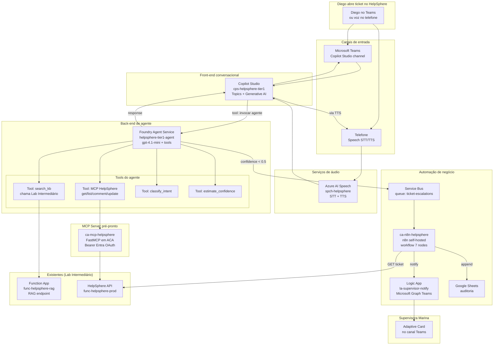

# Lab Final — Agente Autônomo + Workflow de Escalação
## Guia Passo-a-Passo no Azure Portal

> **Slides cobertos:** #25-#33 + #34-#38 (Blocos 4 + 5 — Agentes + Automação)
>
> **Disciplina 06** · **Lab 2 de 3** · **Duração estimada:** 9 horas · **Modalidade:** gravada · **Version-anchor:** Q2-2026
>
> **Cenário:** o RAG do Lab Intermediário cobre cerca de 40% dos tickets simples. Para chegar em 70%+ de auto-resolução, construímos agente híbrido (Copilot Studio + Foundry Agent Service) com tools, MCP, canal de voz, e workflow de escalação humana via n8n self-hosted em Azure Container Apps.

---

> ## ⚠️ CUSTO E FREE TRIAL
> | Item | Valor |
> |------|-------|
> | Custo mensal (recursos deixados rodando) | ~R$ 380/mês |
> | **Custo realista do lab (provisionar e deletar no mesmo dia)** | **R$ 22-30 saindo do bolso** |
> | Compatível com Free Trial USD 200? | **NÃO** — Foundry Agent Service + ACA exigem Pay-As-You-Go |
> | Custo se esquecer ligado 1 mês | R$ 380+/mês (ACA mais Speech rateado) |
>
> **Atenção especial:** Copilot Studio licenciamento separado — ver Passo 2.0. Para o lab, usaremos trial 30 dias gratuito do Copilot Studio.

---

## Pré-requisitos

- ✅ Lab Intermediário concluído (entendimento de RAG, Function App, métricas)
- ✅ `rg-helpsphere-ia` ainda existindo com Foundry Hub
- ✅ Quota Azure OpenAI com `gpt-4.1-mini` deployado (do Lab Intermediário) ou re-deploy neste lab
- ✅ Conta Microsoft 365 com permissão de criar agentes em Copilot Studio (ou trial 30 dias)
- ✅ Permissão para criar Service Principal e App Registration em Entra ID
- ✅ Docker Desktop instalado (para build da imagem MCP local antes do push para ACR)
- ✅ VS Code com extensão Azure Container Apps

### Recursos pré-prontos disponíveis (não implementar)

Esta disciplina entrega 2 componentes pré-prontos. Você **NÃO implementa** — apenas configura e usa:

1. **MCP Server HelpSphere** (`03_Aplicações/mcp-helpsphere/`)
   - Python + FastMCP + ACA-ready
   - Imagem Docker pública: `tftecr.azurecr.io/mcp-helpsphere:v1.0`
   - 4 tools: `get_ticket`, `list_tickets`, `add_comment`, `update_status`

2. **Workflow de escalação n8n** (`03_Aplicações/n8n-workflows/escalation.json`)
   - Importável no n8n após provisão
   - 7 nodes determinísticos

### 🔗 Repositório companion (estado finalizado do Lab Final)

> **GitHub:** [`apex-helpsphere-agente-lab`](https://github.com/tftec-guilherme/apex-helpsphere-agente-lab) — repo público com código completo do agente + MCP server + workflows n8n + Speech config + tests. Use para:
>
> - **Fork-and-adapt** após completar o lab (substitua secrets pelos seus, faça `azd up`)
> - **Consulta** durante o lab quando travar em algum Passo
> - **Referência** do estado final esperado (compare com seu progresso)
>
> ⚠️ Este repo é um **scaffold inicial** (`v0.1.0-init`) — código completo será preenchido durante a gravação dos Blocos do Lab Final.

---

## Tabela de recursos que serão criados

| Recurso | Nome canônico | SKU/Tier | Custo mensal | Custo no lab |
|---|---|---|---|---|
| Resource Group | `rg-lab-final` | N/A | Gratuito | — |
| **Copilot Studio Agent** | `cps-helpsphere-tier1` | Trial 30 dias OR Premium licença | R$ 90/usuário (após trial) | gratuito (trial) |
| **Foundry Agent Service** | (no Project `aifproj-helpsphere-agente`) | gpt-4.1-mini consumption | varia | R$ 5-8 |
| Azure OpenAI deployment | `gpt-4.1-mini` (re-deploy ou compartilhado) | 30K TPM | varia | já contado no Lab Inter |
| Azure AI Speech | `spch-helpsphere` | S0 Standard | pago por uso | R$ 2-3 |
| ACA Environment | `cae-helpsphere-final` | — | R$ 0 (ambiente) | — |
| ACA n8n | `ca-n8n-helpsphere` | 0.5 vCPU, 1 Gi RAM, scale 0-1 | ~R$ 80 | R$ 3-4 |
| ACA MCP Server | `ca-mcp-helpsphere` | 0.5 vCPU, 1 Gi RAM, scale 0-1 | ~R$ 80 | R$ 3-4 |
| Azure Container Registry | `acrhelpsphere{rand}` | Basic | ~R$ 25 | R$ 1 |
| Azure Database PostgreSQL | `pg-n8n-{rand}` | Burstable B1ms | ~R$ 75 | R$ 3 |
| Service Bus | `sb-helpsphere-final` | Standard | ~R$ 55 | R$ 2 |
| Logic Apps (notificação) | `la-supervisor-notify` | Consumption | ~R$ 1 | desprezível |
| Application Insights (compartilhado) | `ai-helpsphere-rag` (do Lab Inter) | Workspace-based | já criado | — |
| Entra App Registration MCP | `app-mcp-helpsphere-client` | — | gratuito | — |
| **Total** | | | **~R$ 380/mês ligado** | **R$ 22-30 lab realista** |

---

## Diagrama da arquitetura



---

## Estrutura do lab — 8 partes ao longo de 9 horas

| Parte | Duração | Atividade |
|---|---|---|
| Parte 1 | 15min | Provisionar fundação RG + ACR (ACA Environment foi movido para a Parte 4) |
| Parte 2 | 1.5h | Copilot Studio — agente + topics + canal Teams |
| Parte 3 | 2h | Foundry Agent Service — agent code-first + 4 tools |
| Parte 4 | 1.5h | ACA Environment + RBAC + MCP Server HelpSphere (deploy do pré-pronto em ACA) |
| Parte 5 | 1h | Azure AI Speech — canal de voz |
| Parte 6 | 1.5h | n8n self-hosted em ACA + workflow de escalação |
| Parte 7 | 1h | Service Bus + Logic App + Google Sheets connector |
| Parte 8 | 30min | Demo end-to-end com 5 tickets + cleanup |

---

# Parte 1 — Provisionar fundação (30min)

## Passo 1.1 — Criar Resource Group

**No Portal Azure:**

1. Barra superior → buscar **"Resource groups"** → clicar
2. **+ Create**
3. Preencher tab **Basics**:
   - **Subscription:** sua
   - **Resource group:** `rg-lab-final`
   - **Region:** `East US 2`
4. Tab **Tags** (opcional, mas recomendado para cost tracking):
   - `cost-center` = `apex-helpsphere-ia`
   - `environment` = `lab`
   - `application` = `helpsphere-ia`
5. **Review + create** → **Create**
6. Aguardar provisioning ~15s até **Succeeded**

<!-- screenshot: passo-1.1-criar-resource-group-portal.png -->

> **Alternativa via Azure CLI:**
>
> ```bash
> az login
> az group create \
>   --name rg-lab-final \
>   --location eastus2 \
>   --tags cost-center=apex-helpsphere-ia environment=lab application=helpsphere-ia
> ```

## Passo 1.2 — Criar Azure Container Registry

**No Portal Azure:**

1. Barra superior → buscar **"Container registries"** → clicar
2. **+ Create**
3. Preencher tab **Basics**:
   - **Subscription:** sua
   - **Resource group:** `rg-lab-final`
   - **Registry name:** `acrhelpsphere<rand>` (ex.: `acrhelpsphere8a3f2d` — deve ser globalmente único, sem hífen, lowercase, 5-50 chars)
   - **Location:** `East US 2`
   - **Pricing plan:** `Basic`
4. Tab **Authentication**:
   - **Admin user:** `Enabled` (para o lab — em produção use Managed Identity puro)
5. **Review + create** → **Create**
6. Aguardar provisioning ~1-2min até **Succeeded**

<!-- screenshot: passo-1.2-criar-acr-portal.png -->

> **Atenção custo:** ACR Basic cobra ~R$ 25/mês. Delete RG ao final.

> **Por que Basic?** Para o lab é suficiente. Em produção, use Standard ou Premium para geo-replication, content trust, etc.

> **Alternativa via Azure CLI:**
>
> ```bash
> RAND=$(echo $RANDOM | md5sum | head -c 6)
> ACR_NAME="acrhelpsphere${RAND}"
>
> az acr create \
>   --name $ACR_NAME \
>   --resource-group rg-lab-final \
>   --sku Basic \
>   --admin-enabled true
>
> echo "ACR: $ACR_NAME"
> ```

## ✅ Checkpoint Parte 1

- [ ] RG `rg-lab-final` existe
- [ ] ACR `acrhelpsphere{rand}` existe

> **Nota:** o **ACA Environment** (`cae-helpsphere-final`) e o **RBAC AcrPull** da Managed Identity foram movidos para o **início da Parte 4** (Passos 4.4 e 4.5), porque o Portal Azure não permite criar um Container Apps Environment standalone sem associá-lo a um Container App. Criamos os dois juntos do primeiro Container App de fato (MCP Server).

---

# Parte 2 — Copilot Studio agent (1.5h)

## Passo 2.0 — Trial Copilot Studio

Copilot Studio é Power Platform, com licenciamento separado do Azure. Para esta disciplina:

1. Acesse **`copilotstudio.microsoft.com`**
2. Login com sua conta Microsoft 365 (corporativa ou trial)
3. Se primeiro acesso, ativar **30-day free trial**
4. Confirme que está em um environment de **Development** (não Default — Development tem permissões mais soltas)

> **Em produção real:** licenciamento Premium ~R$ 90/usuário/mês ou pay-as-you-go por mensagem. Para PoCs corporativos, trial é suficiente. Discussão detalhada em comitê — material no Apêndice E.

## Passo 2.1 — Criar agent

**No Copilot Studio Maker (copilotstudio.microsoft.com):**

1. Acesse **`https://copilotstudio.microsoft.com`** → entre no environment de **Development**
2. **Create** → **New agent** (a partir do "skeleton")
3. Preencher:
   - **Name:** `HelpSphere Tier 1 Agent`
   - **Description:** `Assistente de tier 1 da Apex HelpSphere — sugere respostas, escala para tier 2 quando necessário.`
   - **Language:** `Portuguese (Brazil)`
   - **Instructions:** (system prompt)
     ```
     Você é o assistente do tier 1 do HelpSphere da Apex Group, central de atendimento.
     Sua função é ajudar atendentes (ex.: Diego) a responder tickets de lojistas e colaboradores internos.

     Regras críticas:
     - Sempre responda em pt-BR a menos que o usuário escreva em outro idioma.
     - Sempre cite a fonte da informação.
     - Se a confidence da sua resposta for menor que 0.5, escale para tier 2.
     - Nunca prometa prazos abaixo de 24h.
     - Se ticket envolver dados pessoais sensíveis, peça redação humana.
     ```
4. **Confirm** para criar
5. Aguardar provisioning ~10-20s até agent abrir no canvas

<!-- screenshot: passo-2.1-criar-copilot-agent.png -->

> **Atenção licença:** Copilot Studio Trial é gratuito 30 dias. Após trial, cobrança ~R$ 90/usuário/mês (Premium) ou pay-as-you-go por mensagem.

## Passo 2.2 — Configurar Generative AI mode

**No Copilot Studio Maker — agente aberto no canvas:**

1. Menu lateral → **Generative AI** (ou **Agent settings** → tab **Generative AI**)
2. **Mode:** selecionar `Generative (free-flowing)` — agente improvisa fora de Topics
3. **Knowledge sources:** vamos adicionar o Foundry Agent (criado na Parte 3) como tool. Por enquanto, deixar vazio.
4. **Save**

<!-- screenshot: passo-2.2-generative-ai-mode.png -->

## Passo 2.3 — Criar Topic estruturado para "Saudação"

Topics são fluxos guiados. Criamos um para padronizar saudação inicial.

**No Copilot Studio Maker — agente aberto no canvas:**

1. Menu lateral → **Topics** → **+ New topic** → **Create from blank**
2. Preencher:
   - **Topic name:** `Saudacao_inicial`
   - **Trigger phrases:**
     - `oi`
     - `olá`
     - `bom dia`
     - `boa tarde`
     - `boa noite`
   - **Trigger by message:** `Yes`
3. No canvas do topic, adicionar nodes:
   - **+ Add node** → **Send a message** → texto: `Olá! Sou o assistente do HelpSphere. Em que posso ajudar com seu ticket?`
4. **Save**

<!-- screenshot: passo-2.3-topic-saudacao.png -->

## Passo 2.4 — Criar Topic "Resolver_ticket"

Esse é o topic principal — ele chama o Foundry Agent (criado na Parte 3) via custom action.

**No Copilot Studio Maker — agente aberto no canvas:**

1. Menu lateral → **Topics** → **+ New topic** → **Create from blank**
2. Preencher:
   - **Topic name:** `Resolver_ticket`
   - **Trigger:** `Description-based` (Generative AI decide quando entrar)
   - **Description for AI:** `Use este topic quando o usuário descreve um problema ou pergunta sobre um ticket específico do HelpSphere.`
3. No canvas do topic, adicionar nodes:
   - **+ Add node** → **Ask a question** → mensagem: `Qual o problema do ticket que você precisa de ajuda?` → variável de saída: `userQuery`
   - **+ Add node** → **Call an action** → deixar placeholder (configuraremos no Passo 8.1 após Parte 3)
4. **Save**

<!-- screenshot: passo-2.4-topic-resolver-ticket.png -->

Volte na Parte 2 após Parte 3 (configurar a Call an action).

## Passo 2.5 — Configurar canal Teams (volte aqui após Parte 3)

> Esse passo **depende** de você ter feito Parte 3 (Foundry Agent) e Parte 4 (MCP) primeiro.

**No Copilot Studio Maker — agente aberto no canvas:**

1. Menu lateral → **Channels**
2. Card **Microsoft Teams** → **+ Add channel**
3. **Confirm** — Copilot Studio gera um App package
4. **Open in Teams admin** → instalar para a organização (admin precisa aprovar) OU para si mesmo via **Test in Teams**
5. Após aprovado/testado, agent fica acessível como bot Teams

<!-- screenshot: passo-2.5-canal-teams.png -->

> **Atenção licença Teams:** instalação org-wide exige role Microsoft 365 Tenant Admin. Para o lab, use **Test in Teams** (sem admin necessário).

## ✅ Checkpoint Parte 2 (parcial — completa após Parte 3)

- [ ] Agent `HelpSphere Tier 1 Agent` criado
- [ ] Generative AI mode ativo
- [ ] Topic `Saudacao_inicial` criado e testado
- [ ] Topic `Resolver_ticket` criado (sem ação ainda)

---

# Parte 3 — Foundry Agent Service (2h)

## Passo 3.1 — Criar Foundry Project dedicado

**No Azure AI Foundry portal (ai.azure.com):**

1. Acesse `https://ai.azure.com` → entre no Hub `aifhub-apex-prod` (criado no Bloco 2)
2. **+ New project**
3. Preencher:
   - **Project name:** `aifproj-helpsphere-agente`
   - **Hub:** `aifhub-apex-prod` (já selecionado)
4. **Create**
5. Aguardar provisioning ~1-2min até project abrir

<!-- screenshot: passo-3.1-criar-foundry-project.png -->

## Passo 3.2 — Confirmar deployment gpt-4.1-mini

**No Azure AI Foundry portal (ai.azure.com):**

1. Entre no Project `aifproj-helpsphere-agente`
2. Menu lateral → **Models + endpoints**
3. Verifique se já existe deployment `gpt-4.1-mini` (compartilhado do Lab Intermediário)
4. Se NÃO existe:
   - **+ Deploy model** → buscar `gpt-4.1-mini` → **Confirm**
   - **Deployment name:** `gpt-4.1-mini`
   - **Deployment type:** `Standard`
   - **Tokens per Minute Rate Limit:** `30K`
   - **Deploy**
   - Aguardar ~1min até **Succeeded**
5. Anote da página do deployment:
   - **Target URI** (endpoint)
   - **Key** (API key)

<!-- screenshot: passo-3.2-confirmar-deployment-gpt41mini.png -->

> **Atenção custo:** `gpt-4.1-mini` cobra por 1M tokens (input + output). Para o lab, R$ 5-8 com cap em 30K TPM.

## Passo 3.3 — Criar agent via SDK Python

Crie pasta local `agent-helpsphere/` com:

`requirements.txt`:
```
azure-ai-projects==1.0.0b9
azure-identity
openai>=1.40.0
requests
```

> **Nota SDK:** `azure-ai-projects==1.0.0b9` (preview). Pinned hard porque GA Q3-2026 vai introduzir breaking changes (e.g., `client.agents.create_message` virou `client.agents.threads.messages.create`). Quando GA sair, atualize seguindo migration guide.

`create_agent.py`:
```python
"""
Cria o helpsphere-tier1-agent no Foundry Agent Service.
Define system prompt + 4 tools (function calling).
"""
import os
from azure.ai.projects import AIProjectClient
from azure.identity import DefaultAzureCredential

PROJECT_CONNECTION_STRING = os.environ["AI_PROJECT_CONNECTION_STRING"]
RAG_FUNCTION_URL = os.environ["RAG_FUNCTION_URL"]
RAG_FUNCTION_KEY = os.environ["RAG_FUNCTION_KEY"]
MCP_SERVER_URL = os.environ["MCP_SERVER_URL"]

client = AIProjectClient.from_connection_string(
    credential=DefaultAzureCredential(),
    conn_str=PROJECT_CONNECTION_STRING,
)

# Tool 1: search_kb (chama RAG do Lab Intermediário)
search_kb_tool = {
    "type": "function",
    "function": {
        "name": "search_kb",
        "description": "Busca na base de conhecimento corporativa (manuais, runbooks, FAQs, políticas) sugestões de resposta para um problema descrito. Retorna sugestão com citações e score de confiança.",
        "parameters": {
            "type": "object",
            "properties": {
                "query": {"type": "string", "description": "Descrição do problema/pergunta a buscar"},
                "ticket_id": {"type": "string", "description": "ID do ticket (opcional)"},
            },
            "required": ["query"]
        }
    }
}

# Tool 2: get_ticket (via MCP)
get_ticket_tool = {
    "type": "function",
    "function": {
        "name": "get_ticket",
        "description": "Recupera dados completos de um ticket do HelpSphere pelo ID. Retorna descrição, status, categoria, prioridade, anexos, histórico.",
        "parameters": {
            "type": "object",
            "properties": {
                "ticket_id": {"type": "integer", "description": "ID numérico do ticket"}
            },
            "required": ["ticket_id"]
        }
    }
}

# Tool 3: list_similar_tickets (via MCP)
list_similar_tool = {
    "type": "function",
    "function": {
        "name": "list_similar_tickets",
        "description": "Lista tickets passados resolvidos com mesma categoria — útil para basear sugestão em casos análogos.",
        "parameters": {
            "type": "object",
            "properties": {
                "category": {"type": "string"},
                "limit": {"type": "integer", "default": 5},
            },
            "required": ["category"]
        }
    }
}

# Tool 4: escalate_ticket (dispara workflow n8n via Service Bus)
escalate_tool = {
    "type": "function",
    "function": {
        "name": "escalate_ticket",
        "description": "Escala ticket para tier 2 (supervisora Marina). Use quando confidence < 0.5 ou quando o caso envolver complexidade alta. Dispara workflow estruturado de notificação.",
        "parameters": {
            "type": "object",
            "properties": {
                "ticket_id": {"type": "integer"},
                "reason": {"type": "string", "description": "Motivo da escalação"},
                "confidence": {"type": "number", "description": "Confidence calculado (0-1)"},
            },
            "required": ["ticket_id", "reason", "confidence"]
        }
    }
}

# Cria agent
agent = client.agents.create_agent(
    model="gpt-4.1-mini",
    name="helpsphere-tier1-agent",
    instructions="""Você é o agente autônomo de tier 1 da Apex HelpSphere.

Quando recebe uma pergunta sobre ticket:
1. Use `search_kb` para buscar resposta na base de conhecimento corporativa
2. Se confidence retornado < 0.5, use `escalate_ticket` em vez de tentar responder
3. Para casos onde precisa contexto adicional, use `get_ticket` e `list_similar_tickets`
4. Sempre cite as fontes ([Manual X, seção Y]) na resposta final
5. Resposta em pt-BR, tom profissional, conciso (max 200 palavras)
6. Se a pergunta envolver dados pessoais sensíveis (CPF, salário, dados médicos), responda "Esse caso requer redação humana — escalando para tier 2." e use `escalate_ticket`.

NUNCA invente informação que não esteja no kb. Se não encontrar, escale.""",
    tools=[search_kb_tool, get_ticket_tool, list_similar_tool, escalate_tool],
)

print(f"[+] Agent criado: {agent.id}")
print(f"    Model: {agent.model}")
print(f"    Tools: {len(agent.tools)}")
```

## Passo 3.4 — Setup env vars e rodar

```bash
cd agent-helpsphere/
python -m venv venv
source venv/bin/activate
pip install -r requirements.txt

# Connection string do Foundry Project (em ai.azure.com → Project → Settings)
export AI_PROJECT_CONNECTION_STRING="<sua-connection-string>"

# URLs/keys do Lab Intermediário
export RAG_FUNCTION_URL="https://func-helpsphere-rag-{rand}.azurewebsites.net"
export RAG_FUNCTION_KEY="<key>"

# MCP server URL — vamos definir depois da Parte 4
# Por enquanto, placeholder:
export MCP_SERVER_URL="https://placeholder"

python create_agent.py
```

Saída:
```
[+] Agent criado: asst_xxxxxxx
    Model: gpt-4.1-mini
    Tools: 4
```

Anote o `agent.id` (formato `asst_xxxxxxx`) — você vai usar no Copilot Studio.

## Passo 3.5 — Implementar handler de tools

O agent definiu o **schema** das tools, mas não a implementação. O handler é um wrapper Python que executa cada tool e retorna resultado ao agent.

`agent_runner.py`:
```python
"""
Loop de execução do agent — recebe user message, processa runs,
executa tools quando agent decide chamar, retorna resposta final.
"""
import os, json, time, requests
from azure.ai.projects import AIProjectClient
from azure.identity import DefaultAzureCredential

client = AIProjectClient.from_connection_string(
    credential=DefaultAzureCredential(),
    conn_str=os.environ["AI_PROJECT_CONNECTION_STRING"],
)

AGENT_ID = os.environ["AGENT_ID"]
RAG_URL = os.environ["RAG_FUNCTION_URL"]
RAG_KEY = os.environ["RAG_FUNCTION_KEY"]
MCP_URL = os.environ["MCP_SERVER_URL"]
MCP_TOKEN = os.environ.get("MCP_TOKEN", "")

# Implementação das tools
def tool_search_kb(args):
    response = requests.post(
        f"{RAG_URL}/api/tickets/agent/suggest",
        headers={"x-functions-key": RAG_KEY, "Content-Type": "application/json"},
        json={"description": args["query"], "attachment_urls": []},
    )
    data = response.json()
    return {
        "suggestion": data["suggested_response"],
        "citations": data["citations"],
        "confidence": data["confidence"],
    }

def tool_get_ticket(args):
    response = requests.post(
        f"{MCP_URL}/mcp",
        headers={"Authorization": f"Bearer {MCP_TOKEN}", "Content-Type": "application/json"},
        json={
            "jsonrpc": "2.0",
            "method": "tools/call",
            "params": {"name": "get_ticket", "arguments": args},
            "id": 1,
        },
    )
    return response.json().get("result", {})

def tool_list_similar(args):
    response = requests.post(
        f"{MCP_URL}/mcp",
        headers={"Authorization": f"Bearer {MCP_TOKEN}", "Content-Type": "application/json"},
        json={
            "jsonrpc": "2.0",
            "method": "tools/call",
            "params": {"name": "list_tickets", "arguments": {"status": "Resolved", **args}},
            "id": 2,
        },
    )
    return response.json().get("result", {})

def tool_escalate(args):
    """Dispara mensagem em Service Bus → workflow n8n executa."""
    from azure.servicebus import ServiceBusClient, ServiceBusMessage
    sb_conn = os.environ["SB_CONNECTION_STRING"]
    with ServiceBusClient.from_connection_string(sb_conn) as sb:
        sender = sb.get_queue_sender(queue_name="ticket-escalations")
        with sender:
            sender.send_messages(ServiceBusMessage(json.dumps(args)))
    return {"escalated": True, "queue": "ticket-escalations"}

TOOL_HANDLERS = {
    "search_kb": tool_search_kb,
    "get_ticket": tool_get_ticket,
    "list_similar_tickets": tool_list_similar,
    "escalate_ticket": tool_escalate,
}

def run_agent(thread_id: str, user_message: str) -> str:
    # Add message
    client.agents.create_message(thread_id=thread_id, role="user", content=user_message)

    # Create run
    run = client.agents.create_and_process_run(thread_id=thread_id, agent_id=AGENT_ID)

    # Process tool calls if any
    while run.status == "requires_action":
        tool_outputs = []
        for tool_call in run.required_action.submit_tool_outputs.tool_calls:
            fn_name = tool_call.function.name
            fn_args = json.loads(tool_call.function.arguments)
            print(f"  [tool] {fn_name}({fn_args})")
            result = TOOL_HANDLERS[fn_name](fn_args)
            tool_outputs.append({
                "tool_call_id": tool_call.id,
                "output": json.dumps(result, ensure_ascii=False),
            })
        run = client.agents.submit_tool_outputs_to_run(
            thread_id=thread_id, run_id=run.id, tool_outputs=tool_outputs
        )

    # Get final message
    messages = client.agents.list_messages(thread_id=thread_id)
    return messages.data[0].content[0].text.value

if __name__ == "__main__":
    thread = client.agents.create_thread()
    print(f"Thread: {thread.id}\n")

    # Teste simples
    response = run_agent(thread.id, "Lojista relata que pedido 84512 não foi entregue há 7 dias. Como reembolsar?")
    print(f"\n=== Response ===\n{response}")
```

## Passo 3.6 — Deploy do runner como Function App

Para integração com Copilot Studio, o runner precisa estar acessível por HTTP. Vamos transformar em Function App.

Crie `func-agent-runner/`:

```
func-agent-runner/
├── host.json
├── requirements.txt
├── function_app.py  (wrapper HTTP do agent_runner)
```

`function_app.py`:
```python
import azure.functions as func
import json, os
from agent_runner import run_agent
from azure.ai.projects import AIProjectClient
from azure.identity import DefaultAzureCredential

app = func.FunctionApp()
client = AIProjectClient.from_connection_string(
    credential=DefaultAzureCredential(),
    conn_str=os.environ["AI_PROJECT_CONNECTION_STRING"],
)

@app.route(route="agent/chat", methods=["POST"])
def chat(req: func.HttpRequest) -> func.HttpResponse:
    body = req.get_json()
    user_message = body.get("message", "")
    thread_id = body.get("thread_id")

    if not thread_id:
        thread = client.agents.create_thread()
        thread_id = thread.id

    response = run_agent(thread_id, user_message)
    return func.HttpResponse(
        json.dumps({"thread_id": thread_id, "response": response}),
        status_code=200,
        mimetype="application/json",
    )
```

**Deploy: Criar Function App via Portal Azure**

**No Portal Azure:**

1. Barra superior → buscar **"Function App"** → clicar
2. **+ Create** → escolher hosting plan **Consumption**
3. Preencher tab **Basics**:
   - **Subscription:** sua
   - **Resource group:** `rg-lab-final`
   - **Function App name:** `func-helpsphere-agent-<rand>` (ex.: `func-helpsphere-agent-8a3f2d`)
   - **Runtime stack:** `Python`
   - **Version:** `3.11`
   - **Region:** `East US 2`
   - **Operating System:** `Linux`
4. Tab **Storage**:
   - **Storage account:** selecione um existente OU **Create new** com nome auto-gerado
5. Tab **Networking**: deixe defaults (public)
6. Tab **Monitoring**: deixe Application Insights `Enabled` (auto-criado)
7. **Review + create** → **Create**
8. Aguardar provisioning ~3-5min até **Succeeded**

<!-- screenshot: passo-3.6-criar-function-app-portal.png -->

> **Atenção custo:** Function App Consumption cobra ~R$ 0,50 por milhão de execuções + R$ 0,000016 por GB-segundo. Para o lab é praticamente gratuito.

**Configurar app settings (env vars) via Portal:**

1. Function App `func-helpsphere-agent-<rand>` → menu **Settings** → **Environment variables** → **App settings**
2. **+ Add** cada variável:
   - `AI_PROJECT_CONNECTION_STRING` = `<connection string do Foundry Project>`
   - `AGENT_ID` = `<asst_xxxxxxx>`
   - `RAG_FUNCTION_URL` = `<URL do Lab Intermediário>`
   - `RAG_FUNCTION_KEY` = `<key>`
   - `MCP_SERVER_URL` = `<a-definir-na-Parte-4>`
   - `MCP_TOKEN` = `<a-definir-na-Parte-4>`
3. **Apply** (rolar até o topo) → **Confirm**
4. Aguardar restart ~30s

<!-- screenshot: passo-3.6-app-settings-portal.png -->

**Deploy do código (CLI local — não tem caminho Portal puro):**

```bash
cd func-agent-runner/
func azure functionapp publish func-helpsphere-agent-<rand> --python
```

> **Alternativa via Azure CLI (criação do recurso):**
>
> ```bash
> # Criar Function App
> FUNC_AGENT_NAME="func-helpsphere-agent-${RAND}"
> az functionapp create \
>   --name $FUNC_AGENT_NAME \
>   --resource-group rg-lab-final \
>   --runtime python \
>   --runtime-version 3.11 \
>   --consumption-plan-location eastus2 \
>   --storage-account $STORAGE_NAME
>
> # Configurar env vars
> az functionapp config appsettings set \
>   --name $FUNC_AGENT_NAME \
>   --resource-group rg-lab-final \
>   --settings \
>     AI_PROJECT_CONNECTION_STRING="<...>" \
>     AGENT_ID="<asst_id>" \
>     RAG_FUNCTION_URL="<...>" \
>     RAG_FUNCTION_KEY="<...>" \
>     MCP_SERVER_URL="<a-definir>" \
>     MCP_TOKEN="<a-definir>"
>
> # Deploy
> cd func-agent-runner/
> func azure functionapp publish $FUNC_AGENT_NAME --python
> ```

## ✅ Checkpoint Parte 3

- [ ] Project `aifproj-helpsphere-agente` criado
- [ ] Agent `helpsphere-tier1-agent` registrado com 4 tools
- [ ] `agent_runner.py` testado localmente (uma run completa)
- [ ] Function App `func-agent-runner` deployada e acessível

---

# Parte 4 — MCP Server HelpSphere (deploy do pré-pronto) (1h)

> O código fonte do MCP está em `03_Aplicações/mcp-helpsphere/`. **Você não implementa** — apenas builda a imagem, deploya em ACA, e configura conexão no agent.

## Passo 4.1 — Estrutura do MCP Server pré-pronto

```
mcp-helpsphere/
├── Dockerfile
├── requirements.txt
├── server.py               # FastMCP com 4 tools
├── auth.py                 # Validação de token Entra
├── helpsphere_db.py        # Wrapper do SQL HelpSphere
└── README.md
```

`server.py` (referência):
```python
"""
MCP Server HelpSphere — FastMCP + Entra OAuth + SQL backend.
"""
from fastmcp import FastMCP
from auth import require_scope
from helpsphere_db import HelpSphereDB
import os

mcp = FastMCP("helpsphere")
db = HelpSphereDB(os.environ["HELPSPHERE_SQL_CONNECTION"])

@mcp.tool()
@require_scope("helpsphere.tickets.read")
def get_ticket(ticket_id: int) -> dict:
    """Recupera dados completos de um ticket."""
    return db.get_ticket(ticket_id)

@mcp.tool()
@require_scope("helpsphere.tickets.read")
def list_tickets(status: str = "Open", limit: int = 10, category: str = None) -> list[dict]:
    """Lista tickets filtrando por status e opcionalmente categoria."""
    return db.list_tickets(status=status, limit=limit, category=category)

@mcp.tool()
@require_scope("helpsphere.tickets.write")
def add_comment(ticket_id: int, comment: str, author: str) -> dict:
    """Adiciona comentário a um ticket."""
    return db.add_comment(ticket_id, comment, author)

@mcp.tool()
@require_scope("helpsphere.tickets.write")
def update_status(ticket_id: int, new_status: str) -> dict:
    """Atualiza status do ticket. Status válidos: Open, InProgress, Resolved, Escalated."""
    return db.update_status(ticket_id, new_status)

@mcp.resource("helpsphere://tickets/{ticket_id}")
def ticket_resource(ticket_id: int) -> str:
    return str(db.get_ticket(ticket_id))

if __name__ == "__main__":
    mcp.run(transport="http", host="0.0.0.0", port=8000)
```

## Passo 4.2 — Build da imagem Docker

```bash
cd 03_Aplicações/mcp-helpsphere/

az acr build \
  --registry $ACR_NAME \
  --image mcp-helpsphere:v1 \
  --file Dockerfile \
  .
```

Tempo: ~3-5min. Verifique:
```bash
az acr repository list --name $ACR_NAME --output table
```

Deve listar `mcp-helpsphere`.

## Passo 4.3 — Criar App Registration para auth

**No Portal Azure:**

1. Barra superior → buscar **"Microsoft Entra ID"** → clicar
2. Menu lateral → **App registrations** → **+ New registration**
3. Preencher:
   - **Name:** `app-mcp-helpsphere-server`
   - **Supported account types:** `Accounts in this organizational directory only (Single tenant)`
   - **Redirect URI:** deixar vazio (server-side only)
4. **Register**
5. Anote da **Overview** page:
   - **Application (client) ID** — vamos chamar de `MCP_SERVER_APP_ID`
   - **Directory (tenant) ID**

<!-- screenshot: passo-4.3-app-reg-server-portal.png -->

**Definir Application ID URI:**

1. App reg `app-mcp-helpsphere-server` → menu **Expose an API**
2. **Application ID URI** → **Add** → editar para `api://mcp-helpsphere` → **Save**

<!-- screenshot: passo-4.3-app-id-uri.png -->

**Adicionar scopes:**

1. Ainda em **Expose an API** → **+ Add a scope**
2. Preencher (3 vezes, um por scope):
   - **Scope 1:**
     - Scope name: `helpsphere.tickets.read`
     - Who can consent: `Admins and users`
     - Admin consent display name: `Read tickets`
     - Admin consent description: `Permite ler dados de tickets`
     - State: `Enabled`
     - **Add scope**
   - **Scope 2:** `helpsphere.tickets.write` — display `Write tickets`, descrição `Permite criar/editar tickets`
   - **Scope 3:** `helpsphere.kb.read` — display `Read KB`, descrição `Permite ler base de conhecimento`

<!-- screenshot: passo-4.3-scopes.png -->

> **Alternativa via Azure CLI:**
>
> ```bash
> APP_NAME="app-mcp-helpsphere-server"
> APP_OBJECT_ID=$(az ad app create \
>   --display-name $APP_NAME \
>   --identifier-uris "api://mcp-helpsphere" \
>   --query id -o tsv)
>
> APP_ID=$(az ad app show --id $APP_OBJECT_ID --query appId -o tsv)
> echo "MCP Server app ID: $APP_ID"
> ```
>
> (Scopes ainda precisam ser adicionados via Portal — `az ad app` não tem comando direto para `oauth2PermissionScopes`.)

## Passo 4.4 — Criar ACA Environment

> **Nota pedagógica (Q2-2026):** o Portal Azure **não permite** criar um Container Apps Environment standalone sem associar a um Container App. Por isso fazemos a criação do Environment **junto** com o primeiro Container App (Passo 4.6) ou usando o caminho específico **"Container Apps Environments"** (plural) no Marketplace.

**Opção A — via Portal (caminho direto):**

1. Acesse `https://portal.azure.com/#create/Microsoft.ManagedEnvironment` (link direto pro blade do Environment standalone)
2. Preencher tab **Basics**:
   - **Subscription:** sua
   - **Resource group:** `rg-lab-final`
   - **Environment name:** `cae-helpsphere-final`
   - **Region:** `East US 2`
3. Tab **Monitoring**:
   - **Logs destination:** `Azure Log Analytics`
   - **Log Analytics workspace:** selecione `log-helpsphere-ia` do RG `rg-helpsphere-ia` (compartilhado, criado no Bloco 2)
4. Tab **Networking**: deixe defaults (managed network, public)
5. **Review + create** → **Create**
6. Aguardar provisioning ~3-5min até **Succeeded**

<!-- screenshot: passo-4.4-criar-aca-environment-portal.png -->

> **Atenção:** o ACA Environment usa o Log Analytics Workspace do `rg-helpsphere-ia` (compartilhado, criado no Bloco 2). Se ainda não criou esse RG/workspace, faça o Bloco 2 antes.

**Opção B — via Azure CLI (alternativa mais rápida):**

```bash
az containerapp env create \
  --name cae-helpsphere-final \
  --resource-group rg-lab-final \
  --location eastus2 \
  --logs-workspace-id $(az monitor log-analytics workspace show \
    --resource-group rg-helpsphere-ia \
    --workspace-name log-helpsphere-ia \
    --query customerId -o tsv) \
  --logs-workspace-key $(az monitor log-analytics workspace get-shared-keys \
    --resource-group rg-helpsphere-ia \
    --workspace-name log-helpsphere-ia \
    --query primarySharedKey -o tsv)
```

**Opção C — durante o Passo 4.6 (Create Container App):** ao escolher o Environment no dropdown, clicar **+ Create new** e preencher inline. Funciona, mas dá menos visibilidade do que aconteceu no Environment standalone.

## Passo 4.5 — Atribuir RBAC AcrPull ao Managed Identity (do Bloco 2)

A Managed Identity `mi-helpsphere-ia` (criada no Bloco 2 em `rg-helpsphere-ia`) precisa de role `AcrPull` no ACR `acrhelpsphere{rand}` (criado no Passo 1.2) para que o Container App consiga puxar a imagem privada.

```bash
PRINCIPAL_ID=$(az identity show \
  --name mi-helpsphere-ia \
  --resource-group rg-helpsphere-ia \
  --query principalId -o tsv)

ACR_ID=$(az acr show --name $ACR_NAME --resource-group rg-lab-final --query id -o tsv)

az role assignment create \
  --assignee $PRINCIPAL_ID \
  --role AcrPull \
  --scope $ACR_ID
```

## Passo 4.6 — Deploy MCP Server em Container App

**No Portal Azure:**

1. Barra superior → buscar **"Container Apps"** → clicar
2. **+ Create** → **Container App**
3. Preencher tab **Basics**:
   - **Subscription:** sua
   - **Resource group:** `rg-lab-final`
   - **Container app name:** `ca-mcp-helpsphere`
   - **Region:** `East US 2`
   - **Container Apps Environment:** `cae-helpsphere-final` (criado no Passo 4.4)
4. Tab **Container**:
   - **Use quickstart image:** `Off`
   - **Image source:** `Azure Container Registry`
   - **Registry:** `acrhelpsphere<rand>.azurecr.io` (criado no Passo 1.2)
   - **Image:** `mcp-helpsphere`
   - **Image tag:** `v1`
   - **CPU and Memory:** `0.5 CPU / 1 Gi memory`
   - **Environment variables:**
     - `HELPSPHERE_SQL_CONNECTION` = `<connection string do HelpSphere SQL>`
     - `AZURE_TENANT_ID` = `<seu tenant ID>`
     - `EXPECTED_AUDIENCE` = `api://mcp-helpsphere`
5. Tab **Ingress**:
   - **Ingress:** `Enabled`
   - **Ingress traffic:** `Accepting traffic from anywhere`
   - **Target port:** `8000`
6. Tab **Identity**:
   - **User-assigned managed identity:** **+ Add** → selecionar `mi-helpsphere-ia` (do RG `rg-helpsphere-ia`, criado no Bloco 2)
7. Tab **Scaling**:
   - **Min replicas:** `0`
   - **Max replicas:** `1`
8. **Review + create** → **Create**
9. Aguardar provisioning ~2-3min até **Succeeded**

<!-- screenshot: passo-4.4-deploy-aca-mcp-portal.png -->

> **Atenção custo:** ACA cobra ~R$ 80/mês com scale-to-zero. No lab realista (provisiona+deleta no dia), R$ 3-4.

**Após criado, anotar URL:**

1. Container app `ca-mcp-helpsphere` → **Overview**
2. Anote **Application Url** (formato `https://ca-mcp-helpsphere.<region-fqdn>.azurecontainerapps.io`) — vamos chamar de `MCP_URL`
3. URL completa do MCP endpoint: `${MCP_URL}/mcp`

<!-- screenshot: passo-4.4-mcp-url-anotar.png -->

> **Alternativa via Azure CLI:**
>
> ```bash
> HELPSPHERE_SQL_CONN="<connection-string-do-HelpSphere-SQL>"
>
> az containerapp create \
>   --name ca-mcp-helpsphere \
>   --resource-group rg-lab-final \
>   --environment cae-helpsphere-final \
>   --image $ACR_NAME.azurecr.io/mcp-helpsphere:v1 \
>   --target-port 8000 \
>   --ingress external \
>   --registry-server $ACR_NAME.azurecr.io \
>   --registry-identity $(az identity show -n mi-helpsphere-ia -g rg-helpsphere-ia --query id -o tsv) \
>   --user-assigned $(az identity show -n mi-helpsphere-ia -g rg-helpsphere-ia --query id -o tsv) \
>   --env-vars \
>     HELPSPHERE_SQL_CONNECTION="$HELPSPHERE_SQL_CONN" \
>     AZURE_TENANT_ID="<seu-tenant-id>" \
>     EXPECTED_AUDIENCE="api://mcp-helpsphere" \
>   --min-replicas 0 \
>   --max-replicas 1 \
>   --cpu 0.5 \
>   --memory 1Gi
>
> MCP_URL=$(az containerapp show \
>   --name ca-mcp-helpsphere \
>   --resource-group rg-lab-final \
>   --query "properties.configuration.ingress.fqdn" -o tsv)
>
> echo "MCP Server URL: https://$MCP_URL/mcp"
> ```

## Passo 4.7 — Criar App Registration cliente (para o agent autenticar)

**No Portal Azure:**

1. Barra superior → buscar **"Microsoft Entra ID"** → clicar
2. Menu lateral → **App registrations** → **+ New registration**
3. Preencher:
   - **Name:** `app-mcp-helpsphere-client`
   - **Supported account types:** `Accounts in this organizational directory only (Single tenant)`
   - **Redirect URI:** deixar vazio (client-credentials flow only)
4. **Register**
5. Anote da **Overview** page:
   - **Application (client) ID** — vamos chamar de `CLIENT_APP_ID`

<!-- screenshot: passo-4.5-app-reg-client-portal.png -->

**Criar Client Secret:**

1. App reg `app-mcp-helpsphere-client` → menu **Certificates & secrets** → tab **Client secrets**
2. **+ New client secret**
3. Preencher:
   - **Description:** `mcp-client-secret-lab`
   - **Expires:** `90 days` (ou `12 months` se quiser reutilizar)
4. **Add**
5. **IMPORTANTE:** copie o **Value** (NÃO o Secret ID) IMEDIATAMENTE — só aparece uma vez. Vamos chamar de `CLIENT_SECRET`.

<!-- screenshot: passo-4.5-client-secret.png -->

**Adicionar API permissions:**

1. App reg `app-mcp-helpsphere-client` → menu **API permissions** → **+ Add a permission**
2. Tab **My APIs** → selecionar `app-mcp-helpsphere-server`
3. **Delegated permissions** (ou **Application permissions** se for client-credentials puro — para o lab, ambos funcionam):
   - Marcar `helpsphere.tickets.read`
   - Marcar `helpsphere.tickets.write`
   - Marcar `helpsphere.kb.read`
4. **Add permissions**
5. **Grant admin consent for <tenant>** (botão azul) → **Yes** — status deve virar verde **Granted**

<!-- screenshot: passo-4.5-api-permissions-consent.png -->

> **Alternativa via Azure CLI:**
>
> ```bash
> CLIENT_APP_NAME="app-mcp-helpsphere-client"
> CLIENT_APP_OBJECT_ID=$(az ad app create \
>   --display-name $CLIENT_APP_NAME \
>   --query id -o tsv)
>
> CLIENT_APP_ID=$(az ad app show --id $CLIENT_APP_OBJECT_ID --query appId -o tsv)
>
> # Criar client secret
> CLIENT_SECRET=$(az ad app credential reset \
>   --id $CLIENT_APP_OBJECT_ID \
>   --append \
>   --query password -o tsv)
>
> echo "Client App ID: $CLIENT_APP_ID"
> echo "Client Secret: $CLIENT_SECRET"
> ```
>
> (API permissions + admin consent ainda precisam ser feitos via Portal — fluxo CLI é mais complexo.)

## Passo 4.8 — Obter token de teste

```bash
TENANT_ID="<seu-tenant-id>"

TOKEN=$(curl -s -X POST "https://login.microsoftonline.com/${TENANT_ID}/oauth2/v2.0/token" \
  -d "grant_type=client_credentials" \
  -d "client_id=${CLIENT_APP_ID}" \
  -d "client_secret=${CLIENT_SECRET}" \
  -d "scope=api://mcp-helpsphere/.default" \
  | jq -r .access_token)

echo "Token: $TOKEN"
```

## Passo 4.9 — Testar MCP Server

```bash
curl -X POST "https://${MCP_URL}/mcp" \
  -H "Authorization: Bearer ${TOKEN}" \
  -H "Content-Type: application/json" \
  -d '{
    "jsonrpc": "2.0",
    "method": "tools/list",
    "id": 1
  }'
```

Saída esperada: lista das 4 tools (`get_ticket`, `list_tickets`, `add_comment`, `update_status`).

Testar uma tool:
```bash
curl -X POST "https://${MCP_URL}/mcp" \
  -H "Authorization: Bearer ${TOKEN}" \
  -H "Content-Type: application/json" \
  -d '{
    "jsonrpc": "2.0",
    "method": "tools/call",
    "params": {
      "name": "get_ticket",
      "arguments": {"ticket_id": 1}
    },
    "id": 2
  }'
```

Deve retornar dados do ticket 1 (do seed do HelpSphere).

## Passo 4.10 — Atualizar Function App `func-agent-runner` com URL e token MCP

```bash
az functionapp config appsettings set \
  --name $FUNC_AGENT_NAME \
  --resource-group rg-lab-final \
  --settings \
    MCP_SERVER_URL="https://${MCP_URL}" \
    MCP_TOKEN="${TOKEN}"
```

> **Atenção:** o token aqui é estático (válido ~1h). Em produção, o agent renova token via OAuth flow. Para o lab, ok usar token estático e renovar se expirar.

## ✅ Checkpoint Parte 4

- [ ] **ACA Environment `cae-helpsphere-final`** existe e está em estado `Succeeded` (Passo 4.4)
- [ ] **Managed Identity `mi-helpsphere-ia`** tem role `AcrPull` no ACR (Passo 4.5)
- [ ] Imagem `mcp-helpsphere:v1` no ACR
- [ ] App Registration `app-mcp-helpsphere-server` com 3 scopes
- [ ] App Registration `app-mcp-helpsphere-client` com permissões consented
- [ ] ACA `ca-mcp-helpsphere` rodando, URL pública acessível
- [ ] cURL `tools/list` retorna 4 tools
- [ ] cURL `tools/call get_ticket` retorna ticket do banco

---

# Parte 5 — Azure AI Speech (canal de voz) (1h)

## Passo 5.1 — Criar Azure AI Speech

**No Portal Azure:**

1. Barra superior → buscar **"Speech Services"** → clicar
2. **+ Create**
3. Preencher tab **Basics**:
   - **Subscription:** sua
   - **Resource group:** `rg-lab-final`
   - **Region:** `East US 2`
   - **Name:** `spch-helpsphere`
   - **Pricing tier:** `Standard S0`
4. Tab **Network**: deixar `All networks` (default)
5. Tab **Identity**: opcional — habilitar `System assigned` se quiser
6. **Review + create** → **Create**
7. Aguardar provisioning ~30s-1min até **Succeeded**

<!-- screenshot: passo-5.1-criar-speech-portal.png -->

> **Atenção custo:** Speech Standard S0 cobra por uso (~R$ 5 por hora STT, ~R$ 16 por 1M chars TTS). Para o lab, R$ 2-3.

**Anotar credentials:**

1. Recurso `spch-helpsphere` → menu **Resource Management** → **Keys and Endpoint**
2. Anote:
   - `SPEECH_KEY` = **KEY 1**
   - `SPEECH_REGION` = `eastus2`

<!-- screenshot: passo-5.1-keys-endpoint.png -->

> **Alternativa via Azure CLI:**
>
> ```bash
> az cognitiveservices account create \
>   --name spch-helpsphere \
>   --resource-group rg-lab-final \
>   --kind SpeechServices \
>   --sku S0 \
>   --location eastus2 \
>   --yes
> ```

## Passo 5.2 — Atribuir RBAC

```bash
SPCH_ID=$(az cognitiveservices account show -n spch-helpsphere -g rg-lab-final --query id -o tsv)
az role assignment create --assignee $PRINCIPAL_ID --role "Cognitive Services User" --scope $SPCH_ID
```

## Passo 5.3 — Grave seu próprio áudio (5-10s pt-BR)

Em vez de baixar um WAV pré-pronto, vamos gravar o seu próprio. Por quê? Speech STT é mais convincente quando o aluno ouve sua própria voz sendo transcrita.

**Windows:** abra **Voice Recorder** (busca no Start) → Recorde 5-10s da pergunta: *"Como faço para devolver um produto da Apex Mart?"* → Salve como `sample-question-pt.wav` na pasta do lab.

**macOS:** use **QuickTime Player** → File → New Audio Recording → idem.

**Linux/WSL:** use **Audacity** ou `arecord -d 8 -f cd sample-question-pt.wav`.

**No Portal Azure:** suba o WAV no Speech Service via UI Test → Real-time Speech-to-text → upload audio file → veja a transcrição em pt-BR.

Para testar via CLI:

```bash
curl -X POST "https://${SPEECH_REGION}.stt.speech.microsoft.com/speech/recognition/conversation/cognitiveservices/v1?language=pt-BR" \
  -H "Ocp-Apim-Subscription-Key: ${SPEECH_KEY}" \
  -H "Content-Type: audio/wav" \
  --data-binary @sample-question-pt.wav
```

Saída esperada: transcrição em pt-BR.

## Passo 5.4 — Testar TTS (Text-to-Speech)

```bash
curl -X POST "https://${SPEECH_REGION}.tts.speech.microsoft.com/cognitiveservices/v1" \
  -H "Ocp-Apim-Subscription-Key: ${SPEECH_KEY}" \
  -H "Content-Type: application/ssml+xml" \
  -H "X-Microsoft-OutputFormat: audio-24khz-48kbitrate-mono-mp3" \
  -d '<speak version="1.0" xmlns="http://www.w3.org/2001/10/synthesis" xml:lang="pt-BR">
        <voice name="pt-BR-FranciscaNeural">
          Olá, sou a assistente do HelpSphere. Como posso ajudar?
        </voice>
      </speak>' \
  --output greeting.mp3
```

Reproduza o `greeting.mp3` — você deve ouvir a frase.

## Passo 5.5 — Integração com Copilot Studio (canal voz)

Em produção, integraria com Azure Communication Services para receber chamadas. Para o lab demonstramos via API direta.

Crie endpoint na Function `func-agent-runner` que aceita áudio:

`function_app.py` (adicionar):
```python
@app.route(route="agent/voice", methods=["POST"])
def voice(req: func.HttpRequest) -> func.HttpResponse:
    """Recebe áudio WAV → STT → agent → TTS → áudio MP3."""
    audio_bytes = req.get_body()

    # STT
    stt_response = requests.post(
        f"https://{os.environ['SPEECH_REGION']}.stt.speech.microsoft.com/speech/recognition/conversation/cognitiveservices/v1?language=pt-BR",
        headers={"Ocp-Apim-Subscription-Key": os.environ["SPEECH_KEY"], "Content-Type": "audio/wav"},
        data=audio_bytes,
    )
    transcription = stt_response.json().get("DisplayText", "")

    # Agent
    thread = client.agents.create_thread()
    response_text = run_agent(thread.id, transcription)

    # TTS
    ssml = f"""<speak version="1.0" xmlns="http://www.w3.org/2001/10/synthesis" xml:lang="pt-BR">
        <voice name="pt-BR-FranciscaNeural">{response_text}</voice>
    </speak>"""
    tts_response = requests.post(
        f"https://{os.environ['SPEECH_REGION']}.tts.speech.microsoft.com/cognitiveservices/v1",
        headers={
            "Ocp-Apim-Subscription-Key": os.environ["SPEECH_KEY"],
            "Content-Type": "application/ssml+xml",
            "X-Microsoft-OutputFormat": "audio-24khz-48kbitrate-mono-mp3",
        },
        data=ssml.encode("utf-8"),
    )

    return func.HttpResponse(
        body=tts_response.content,
        mimetype="audio/mpeg",
        status_code=200,
    )
```

Re-deploy:
```bash
func azure functionapp publish $FUNC_AGENT_NAME --python
```

## ✅ Checkpoint Parte 5

- [ ] Speech Service `spch-helpsphere` criado
- [ ] STT cURL retornou transcrição em pt-BR
- [ ] TTS cURL gerou MP3 reproduzível
- [ ] Endpoint `/api/agent/voice` deployado

---

# Parte 6 — n8n self-hosted em ACA + workflow (1.5h)

## Passo 6.1 — Criar PostgreSQL para n8n metadata

**No Portal Azure:**

1. Barra superior → buscar **"Azure Database for PostgreSQL flexible servers"** → clicar
2. **+ Create** → **Flexible server**
3. Preencher tab **Basics**:
   - **Subscription:** sua
   - **Resource group:** `rg-lab-final`
   - **Server name:** `pg-n8n-<rand>` (ex.: `pg-n8n-8a3f2d` — globalmente único, lowercase)
   - **Region:** `East US 2`
   - **PostgreSQL version:** `16`
   - **Workload type:** `Development`
   - **Compute + storage:** `Burstable, B1ms (1 vCore, 2 GiB RAM)` — `Configure server` para confirmar
   - **Storage size:** `32 GiB`
   - **Authentication method:** `PostgreSQL authentication only`
   - **Admin username:** `n8nadmin`
   - **Password:** gere senha forte (≥12 chars, com letras+números+símbolos) — anote!
4. Tab **Networking**:
   - **Connectivity method:** `Public access (allowed IP addresses)`
   - **Allow public access from any Azure service:** `Yes` (necessário para ACA n8n acessar)
   - ⚠️ **Em produção:** usar `Private access (VNet)` em vez de public.
5. **Review + create** → **Create**
6. Aguardar provisioning ~5-7min até **Succeeded**

<!-- screenshot: passo-6.1-criar-postgres-portal.png -->

> **Atenção custo:** PostgreSQL B1ms cobra ~R$ 75/mês ligado. No lab realista (provisiona+deleta no dia), R$ 3.

**Criar database `n8n`:**

1. Recurso `pg-n8n-<rand>` → menu **Settings** → **Databases** → **+ Add**
2. **Name:** `n8n` → **Save**

<!-- screenshot: passo-6.1-criar-db-n8n.png -->

**Anote:**
- `PG_HOST` = `pg-n8n-<rand>.postgres.database.azure.com` (página Overview do server)
- `PG_PASSWORD` = senha que você definiu

> **Alternativa via Azure CLI:**
>
> ```bash
> PG_NAME="pg-n8n-${RAND}"
> PG_PASSWORD=$(openssl rand -base64 16)
>
> az postgres flexible-server create \
>   --name $PG_NAME \
>   --resource-group rg-lab-final \
>   --location eastus2 \
>   --admin-user n8nadmin \
>   --admin-password $PG_PASSWORD \
>   --sku-name Standard_B1ms \
>   --tier Burstable \
>   --storage-size 32 \
>   --version 16 \
>   --public-access 0.0.0.0  # demo - em prod use VNet
>
> az postgres flexible-server db create \
>   --resource-group rg-lab-final \
>   --server-name $PG_NAME \
>   --database-name n8n
>
> PG_HOST="${PG_NAME}.postgres.database.azure.com"
> echo "PG: $PG_HOST"
> echo "Password: $PG_PASSWORD"
> ```

## Passo 6.2 — Deploy n8n em ACA

**No Portal Azure:**

1. Barra superior → buscar **"Container Apps"** → clicar
2. **+ Create** → **Container App**
3. Preencher tab **Basics**:
   - **Subscription:** sua
   - **Resource group:** `rg-lab-final`
   - **Container app name:** `ca-n8n-helpsphere`
   - **Region:** `East US 2`
   - **Container Apps Environment:** `cae-helpsphere-final` (criado no Passo 4.4)
4. Tab **Container**:
   - **Use quickstart image:** `Off`
   - **Image source:** `Docker Hub or other registries`
   - **Image type:** `Public`
   - **Registry login server:** `docker.io`
   - **Image and tag:** `n8nio/n8n:1.6` (NÃO use `:latest` — ver troubleshooting #4)
   - **CPU and Memory:** `0.5 CPU / 1 Gi memory`
   - **Environment variables:**
     - `DB_TYPE` = `postgresdb`
     - `DB_POSTGRESDB_HOST` = `<PG_HOST>`
     - `DB_POSTGRESDB_DATABASE` = `n8n`
     - `DB_POSTGRESDB_USER` = `n8nadmin`
     - `DB_POSTGRESDB_PASSWORD` = `<PG_PASSWORD>`
     - `DB_POSTGRESDB_SSL_CA` = (vazio)
     - `N8N_ENCRYPTION_KEY` = `<gerar string aleatória 32 chars base64>` (use `openssl rand -base64 32` localmente)
     - `N8N_HOST` = `0.0.0.0`
     - `N8N_PROTOCOL` = `https`
     - `WEBHOOK_URL` = (vazio — atualizamos abaixo)
     - `GENERIC_TIMEZONE` = `America/Sao_Paulo`
5. Tab **Ingress**:
   - **Ingress:** `Enabled`
   - **Ingress traffic:** `Accepting traffic from anywhere`
   - **Target port:** `5678`
6. Tab **Scaling**:
   - **Min replicas:** `1` (NÃO 0 — ver nota abaixo)
   - **Max replicas:** `1`
7. **Review + create** → **Create**
8. Aguardar provisioning ~3-5min até **Succeeded**

<!-- screenshot: passo-6.2-deploy-n8n-aca-portal.png -->

> **Atenção custo:** ACA n8n com min-replicas 1 cobra ~R$ 80/mês ligado (não faz scale-to-zero). No lab realista, R$ 3-4.

> **Por que `min-replicas 1`?** ACA com `min-replicas 0` faz scale-to-zero. Pra n8n recebendo webhooks de escalação de tickets em produção, scale-to-zero perde mensagens (Service Bus messages chegam enquanto container dorme). Em produção real, use **KEDA Service Bus scaler** com min-replicas 0 mas trigger por queue length. Para este lab, `min-replicas 1` é simples e correto.

**Após criado, anotar URL e atualizar WEBHOOK_URL:**

1. Container app `ca-n8n-helpsphere` → **Overview** → anote **Application Url** (vamos chamar de `N8N_URL`)
2. Menu **Application** → **Containers** → tab **Environment variables** → editar `WEBHOOK_URL` → setar para `https://<N8N_URL>/` → **Save**
3. Container faz restart automático ~30s

<!-- screenshot: passo-6.2-n8n-url-webhook.png -->

> **Alternativa via Azure CLI:**
>
> ```bash
> az containerapp create \
>   --name ca-n8n-helpsphere \
>   --resource-group rg-lab-final \
>   --environment cae-helpsphere-final \
>   --image n8nio/n8n:1.6 \
>   --target-port 5678 \
>   --ingress external \
>   --env-vars \
>     DB_TYPE=postgresdb \
>     DB_POSTGRESDB_HOST="$PG_HOST" \
>     DB_POSTGRESDB_DATABASE=n8n \
>     DB_POSTGRESDB_USER=n8nadmin \
>     DB_POSTGRESDB_PASSWORD="$PG_PASSWORD" \
>     DB_POSTGRESDB_SSL_CA="" \
>     N8N_ENCRYPTION_KEY="$(openssl rand -base64 32)" \
>     N8N_HOST="0.0.0.0" \
>     N8N_PROTOCOL=https \
>     WEBHOOK_URL="" \
>     GENERIC_TIMEZONE="America/Sao_Paulo" \
>   --min-replicas 1 \
>   --max-replicas 1 \
>   --cpu 0.5 \
>   --memory 1Gi
>
> N8N_URL=$(az containerapp show \
>   --name ca-n8n-helpsphere \
>   --resource-group rg-lab-final \
>   --query "properties.configuration.ingress.fqdn" -o tsv)
>
> az containerapp update \
>   --name ca-n8n-helpsphere \
>   --resource-group rg-lab-final \
>   --set-env-vars WEBHOOK_URL="https://${N8N_URL}/"
>
> echo "n8n URL: https://$N8N_URL"
> ```

## Passo 6.3 — Setup inicial n8n

1. Abrir `https://$N8N_URL` no navegador
2. Primeira tela: criar **owner account** (email + password) — guardar bem
3. Pular tutorial inicial

## Passo 6.4 — Importar workflow de escalação

Baixe `escalation.json` (em `03_Aplicações/n8n-workflows/`).

No n8n:
1. **Workflows** → **+ New** → menu três pontos → **Import from file**
2. Selecionar `escalation.json`
3. Workflow `Ticket Escalation` aparece com 7 nodes:
   - Service Bus Trigger
   - HTTP Request (GET ticket)
   - PostgreSQL (SELECT similar)
   - Switch (categoria → supervisor)
   - HTTP Request (Microsoft Graph — post Teams)
   - HTTP Request (PATCH HelpSphere status)
   - Google Sheets (append row)

## Passo 6.5 — Configurar credentials no n8n

Para cada node, configurar credentials. Cada credential é um secret armazenado por n8n.

**Credential 1: Service Bus** (vamos criar Service Bus na Parte 7 — volte aqui depois)

**Credential 2: HTTP Header Auth (HelpSphere API)**
- Type: HTTP Header Auth
- Name: `helpsphere-api`
- Header: `x-functions-key`
- Value: `<HelpSphere function key>`

**Credential 3: PostgreSQL** (HelpSphere DB)
- Connection settings do banco do HelpSphere

**Credential 4: OAuth2 Microsoft (Graph)**
- Type: OAuth2 API
- Authorization URL: `https://login.microsoftonline.com/{tenant}/oauth2/v2.0/authorize`
- Token URL: `https://login.microsoftonline.com/{tenant}/oauth2/v2.0/token`
- Client ID: novo App Registration `app-n8n-graph`
- Scopes: `ChatMessage.Send User.Read`

**Credential 5: Google Sheets OAuth**
- Connect via OAuth Google (configuração separada — Apêndice F do projeto)

## Passo 6.6 — Editar nodes do workflow

Cada node tem placeholders que você precisa substituir pelos valores reais. Detalhamento dos nodes principais:

**Node 1 — Service Bus Trigger:**
- Queue: `ticket-escalations`
- Credential: a do passo 6.5

**Node 5 — HTTP Request (Microsoft Graph para Teams):**
- Method: POST
- URL: `https://graph.microsoft.com/v1.0/teams/{team-id}/channels/{channel-id}/messages`
- Body (Adaptive Card):
```json
{
  "body": {
    "contentType": "html",
    "content": "🚨 <b>Ticket escalado</b><br/>Ticket: {{ $json.ticket_id }}<br/>Motivo: {{ $json.reason }}<br/>Confidence: {{ $json.confidence }}"
  }
}
```

## Passo 6.7 — Ativar workflow

No canvas do workflow → **Active** toggle (canto superior direito) → ON

## ✅ Checkpoint Parte 6

- [ ] PostgreSQL `pg-n8n-{rand}` rodando
- [ ] ACA `ca-n8n-helpsphere` rodando
- [ ] n8n acessível em URL pública
- [ ] Workflow `Ticket Escalation` importado e ativo

---

# Parte 7 — Service Bus + Logic App + Sheets (1h)

## Passo 7.1 — Criar Service Bus namespace

**No Portal Azure:**

1. Barra superior → buscar **"Service Bus"** → clicar
2. **+ Create**
3. Preencher tab **Basics**:
   - **Subscription:** sua
   - **Resource group:** `rg-lab-final`
   - **Namespace name:** `sb-helpsphere-final`
   - **Location:** `East US 2`
   - **Pricing tier:** `Standard`
4. **Review + create** → **Create**
5. Aguardar provisioning ~1-2min até **Succeeded**

<!-- screenshot: passo-7.1-criar-service-bus-namespace.png -->

> **Atenção custo:** Service Bus Standard cobra ~R$ 55/mês ligado. No lab realista, R$ 2.

**Criar Queue `ticket-escalations`:**

1. Namespace `sb-helpsphere-final` → menu **Entities** → **Queues** → **+ Queue**
2. Preencher:
   - **Name:** `ticket-escalations`
   - **Max delivery count:** `3`
   - **Enable dead lettering on message expiration:** `Enabled`
   - Demais campos: defaults
3. **Create**
4. Aguardar criação ~10s

<!-- screenshot: passo-7.1-criar-queue.png -->

**Anotar connection string:**

1. Namespace `sb-helpsphere-final` → menu **Settings** → **Shared access policies**
2. Clicar `RootManageSharedAccessKey`
3. Anote **Primary Connection String** — vamos chamar de `SB_CONN`

<!-- screenshot: passo-7.1-connection-string.png -->

> **Alternativa via Azure CLI:**
>
> ```bash
> SB_NAME="sb-helpsphere-final"
>
> az servicebus namespace create \
>   --name $SB_NAME \
>   --resource-group rg-lab-final \
>   --location eastus2 \
>   --sku Standard
>
> az servicebus queue create \
>   --name ticket-escalations \
>   --namespace-name $SB_NAME \
>   --resource-group rg-lab-final \
>   --max-delivery-count 3 \
>   --enable-dead-lettering-on-message-expiration true
>
> SB_CONN=$(az servicebus namespace authorization-rule keys list \
>   --namespace-name $SB_NAME \
>   --resource-group rg-lab-final \
>   --name RootManageSharedAccessKey \
>   --query primaryConnectionString -o tsv)
>
> echo "Service Bus connection: $SB_CONN"
> ```

## Passo 7.2 — Atualizar Function `func-agent-runner` com SB connection

```bash
az functionapp config appsettings set \
  --name $FUNC_AGENT_NAME \
  --resource-group rg-lab-final \
  --settings SB_CONNECTION_STRING="$SB_CONN"
```

## Passo 7.3 — Configurar credential Service Bus no n8n

No n8n, settings → Credentials → New → Microsoft Azure Service Bus
- Connection String: `$SB_CONN`
- Save

Atualize node Service Bus Trigger do workflow para usar essa credential.

## Passo 7.4 — Testar disparo de escalação

Manualmente publique mensagem na queue para testar:
```bash
az servicebus queue send-message \
  --namespace-name $SB_NAME \
  --resource-group rg-lab-final \
  --queue-name ticket-escalations \
  --body '{"ticket_id": 1, "reason": "Teste manual de escalação", "confidence": 0.3}'
```

Em ~5s, no n8n você deve ver execução do workflow disparada (em **Executions**).

## Passo 7.5 — Logic App de notificação (alternativa)

> Para o lab, n8n já cobre notificação Teams via Microsoft Graph node. Logic App é mostrado como alternativa que algumas empresas preferem.

Skip se você está OK com n8n direto.

**Para implementar — No Portal Azure:**

1. Barra superior → buscar **"Logic apps"** → clicar
2. **+ Add** → escolher **Consumption** plan type
3. Preencher tab **Basics**:
   - **Subscription:** sua
   - **Resource group:** `rg-lab-final`
   - **Logic App name:** `la-supervisor-notify`
   - **Region:** `East US 2`
   - **Enable log analytics:** `No`
4. **Review + create** → **Create**
5. Aguardar provisioning ~1min até **Succeeded**

<!-- screenshot: passo-7.5-criar-logic-app-portal.png -->

> **Atenção custo:** Logic Apps Consumption cobra por execução (~R$ 0,000025/action). Praticamente gratuito no lab.

**Configurar workflow:**

1. Logic App `la-supervisor-notify` → menu **Development Tools** → **Logic app designer**
2. **Trigger:** **Service Bus** → `When a message is received in a queue (auto-complete)`
   - Queue: `ticket-escalations-priority` (criar nova queue antes se quiser separar de `ticket-escalations`)
   - Connection: criar via Connection String do `SB_CONN`
3. **+ New step** → **Microsoft Teams** → `Post adaptive card and wait for a response`
   - Conectar com sua conta Teams
   - Team/Channel: selecionar
   - Card payload: adaptive card JSON com `{ticket_id}`, `{reason}`, `{confidence}` referenciando outputs do trigger
4. **Save**

<!-- screenshot: passo-7.5-logic-app-designer.png -->

> **Alternativa via Azure CLI:**
>
> ```bash
> az logic workflow create \
>   --resource-group rg-lab-final \
>   --location eastus2 \
>   --name la-supervisor-notify \
>   --definition @workflow-definition.json
> ```
>
> (Designer visual no Portal é muito mais prático para Logic Apps Consumption.)

## Passo 7.6 — Google Sheets connector

1. Criar uma planilha Google Sheets vazia: `Apex IA - Auditoria de Escalações`
2. Compartilhar com email da service account Google (ver Apêndice F)
3. Anotar Sheet ID (da URL)
4. No n8n, atualizar node "Google Sheets" do workflow:
   - Sheet ID: o anotado
   - Sheet name: `Sheet1`
   - Operation: Append
   - Columns: timestamp, ticket_id, supervisor, reason, confidence

## ✅ Checkpoint Parte 7

- [ ] Service Bus + queue `ticket-escalations` criados
- [ ] Mensagem teste disparou workflow n8n
- [ ] n8n postou em canal Teams (verificar visualmente no Teams)
- [ ] Linha apareceu na planilha Google

---

## Troubleshooting

7 erros comuns ao executar este Lab Final, com sintomas e fix rápido.

### 1. Copilot Studio knowledge não atualiza após upload

**Sintoma:** Você sobe um PDF/URL como knowledge source no Copilot Studio mas o agente continua respondendo "não sei" ou usando dados antigos.

**Fix:** Aguardar **reindex 5-15 min** após upload. Copilot Studio reindexa knowledge assincronamente. Em **Knowledge** → veja status do source — deve ficar `Ready` (não `Processing`). Se passar 20 min e ainda em `Processing`, remova e re-upload.

### 2. Foundry Agent SDK install fail

**Sintoma:** `pip install azure-ai-projects` falha com erro de version conflict ou `ImportError: cannot import name 'AIProjectClient'`.

**Fix:** Pin versão exata `azure-ai-projects==1.0.0b9` no `requirements.txt` (ver Passo 3.3). Versões `>=1.0.0` resolvem para GA com breaking changes incompatíveis com este lab.

### 3. MCP server não responde

**Sintoma:** cURL para `https://${MCP_URL}/mcp` retorna timeout após 30s, ou `502 Bad Gateway`.

**Fix:** Verificar deploy ACA com:
```bash
az containerapp logs show --name ca-mcp-helpsphere --resource-group rg-lab-final --follow
```
Causas comuns: container em CrashLoopBackoff (logs mostram exception), `--target-port` errado, ou ingress não configurado como `external`.

### 4. n8n não importa escalation.json

**Sintoma:** Ao fazer **Import from file** no n8n, erro "Invalid workflow format" ou nodes aparecem como `unknown`.

**Fix:** Versão n8n incompatível. Use `n8nio/n8n:1.6` (não `:latest`) na imagem do ACA — escalation.json foi exportado nessa versão. Re-deploy:
```bash
az containerapp update --name ca-n8n-helpsphere --resource-group rg-lab-final --image n8nio/n8n:1.6
```

### 5. Speech STT retorna texto vazio

**Sintoma:** cURL pro endpoint STT retorna `{"DisplayText": "", "RecognitionStatus": "InitialSilenceTimeout"}` mesmo com áudio claro.

**Fix:** WAV deve ser **mono 16kHz PCM 16-bit**. Voice Recorder do Windows grava estéreo 48kHz por padrão. Converter com ffmpeg:
```bash
ffmpeg -i sample-question-pt.wav -ac 1 -ar 16000 -sample_fmt s16 sample-mono16k.wav
```
Use o arquivo convertido no cURL.

### 6. Teams Webhook 401

**Sintoma:** Node n8n "Microsoft Graph Teams" retorna `401 Unauthorized` ao postar mensagem.

**Fix:** OAuth token expirado ou permissions faltando. No n8n → **Credentials** → editar credential OAuth2 → **Reconnect** (refresh do token). Validar que App Registration tem permissions `ChatMessage.Send` (delegated) e admin consent foi concedido.

### 7. Confidence score sempre 1.0

**Sintoma:** Tool `search_kb` retorna `confidence: 1.0` em 100% das queries, mesmo quando RAG não encontra contexto bom.

**Fix:** Model `temperature=0` produz over-confident scoring. No deployment do `gpt-4.1-mini` (Foundry → Models + endpoints), ajustar inference parameters: `temperature=0.3`, `top_p=0.9`. Re-deploy. Confidence vira distribuição mais realista 0.4-0.95.

---

# Parte 8 — Demo end-to-end com 5 tickets + Cleanup (30min)

## Passo 8.1 — Configurar Copilot Studio com Foundry Agent + MCP

> Volte agora para o portal Copilot Studio para finalizar a integração.

No agente `HelpSphere Tier 1 Agent`:

1. **Topics** → `Resolver_ticket` → editar
2. Adicionar **Call an action**:
   - **Action type:** HTTP request (custom)
   - **URL:** `https://${FUNC_AGENT_NAME}.azurewebsites.net/api/agent/chat`
   - **Method:** POST
   - **Headers:** `x-functions-key: <key>`
   - **Body:** `{"message": "{{userQuery}}"}`
   - **Output mapping:** `agentResponse = body.response`
3. **Send a message:** `{{agentResponse}}`
4. **Save**

5. Adicionalmente, conectar MCP Server diretamente em Copilot Studio:
   - **Actions** → **+ Add an action** → **Connect to an MCP server**
   - Server URL: `https://${MCP_URL}/mcp`
   - Authentication: OAuth 2.0 Entra ID
   - Tenant ID, Client ID (`app-mcp-helpsphere-client`), Scopes (`api://mcp-helpsphere/.default`)
   - Test connection → deve listar 4 tools
   - Selecionar tools liberadas: get_ticket, list_tickets, add_comment, update_status
   - Save

## Passo 8.2 — Demo dos 5 tickets

Você vai gravar (ou observar via vídeo do professor) demo de 5 tickets.

**Ticket 1 — Caso simples auto-resolvido (tier 1):**
- User no Teams: "Qual horário de atendimento do suporte?"
- Agent: chama search_kb → confidence 0.85 → responde direto com cita em `faq_horario_atendimento.pdf`

**Ticket 2 — Caso usando MCP HelpSphere:**
- User: "Status do ticket 4521?"
- Agent: chama get_ticket(4521) via MCP → responde com dados reais

**Ticket 3 — Caso multilíngue:**
- User em es: "Hola, no puedo acceder al sistema POS de la tienda."
- Agent: detecta es → traduz → search_kb → responde em es com cita

**Ticket 4 — Caso de voz:**
- User envia áudio (ou liga simulado) → STT → agent → TTS → áudio resposta

**Ticket 5 — Caso escalado para tier 2:**
- User: "Lojista pediu reembolso de R$ 50.000 que não está claro nas políticas. Pode aprovar?"
- Agent: search_kb → confidence 0.3 → escalate_ticket → Service Bus → n8n → Teams notifica Marina + Sheets append

> Vídeo do professor demonstra todos os 5 com screen recording.

## Passo 8.3 — Cleanup

> **Cleanup — OPCIONAL:**
> Se você vai fazer Lab Avançado em sequência, **mantenha** `rg-helpsphere-ia` rodando.
>
> Se terminou:
> ```powershell
> az group delete --name rg-helpsphere-ia --yes --no-wait
> ```
> **NÃO esqueça** — custo ~R$ 80-120/mês ativo.

**Cleanup do RG específico do Lab Final — No Portal Azure:**

1. Barra superior → buscar **"Resource groups"** → clicar
2. Clicar `rg-lab-final` → botão **Delete resource group** (topo)
3. Digitar `rg-lab-final` para confirmar → **Delete**
4. Aguardar ~3-5min para todos recursos serem deletados

<!-- screenshot: passo-8.3-delete-rg-portal.png -->

> **Alternativa via Azure CLI:**
>
> ```bash
> az group delete --name rg-lab-final --yes --no-wait
> echo "✅ Lab Final cleanup iniciado"
> ```

**E desativar Copilot Studio agent (para não deixar consumindo licença trial):**

1. Acesse `https://copilotstudio.microsoft.com` → agent `HelpSphere Tier 1 Agent`
2. Menu **Settings** → **Disable** (ou **Delete** se quiser remover)

> **Atenção:** o `rg-helpsphere-ia` (Bloco 2) e o `func-helpsphere-rag` (Lab Intermediário) ainda existem e são consumidos no Lab Avançado. Não delete se for fazer o Lab Avançado em sequência.
>
> Se você deletou `rg-lab-intermediario` ao final do Lab Inter, no Lab Avançado teremos que considerar isso — o Lab Avançado parametriza tudo via Bicep e re-provisiona.

## ✅ Checkpoint final do Lab Final

- [ ] Demo dos 5 tickets executada e funcionou
- [ ] Vídeo de evidência gravado (se desejado pelo professor)
- [ ] `rg-lab-final` deletado
- [ ] Copilot Studio agent desativado
- [ ] Custo total: ≤ R$ 30

---

## Recap do Lab Final

Você implementou em 9h:

✅ Copilot Studio agent multi-canal (Teams + Web)
✅ Foundry Agent Service code-first com 4 tools
✅ MCP Server HelpSphere pré-pronto deployado em ACA
✅ Configuração OAuth Entra ID com scopes granulares
✅ Speech STT + TTS para canal de voz
✅ n8n self-hosted em ACA com workflow de escalação 7 nodes
✅ Service Bus para mensageria assíncrona
✅ Microsoft Graph integration para Teams
✅ Google Sheets connector para auditoria
✅ Demo end-to-end de 5 tickets cobrindo casos diversos

**Próximo:** [Lab Avançado — IA em Produção](Lab_Avancado_IA_Producao_Guia_Portal.md)

---

*Custo total: R$ 22-30 saindo do bolso · Tempo: 9h · Recursos deletados ao final: ✅*
