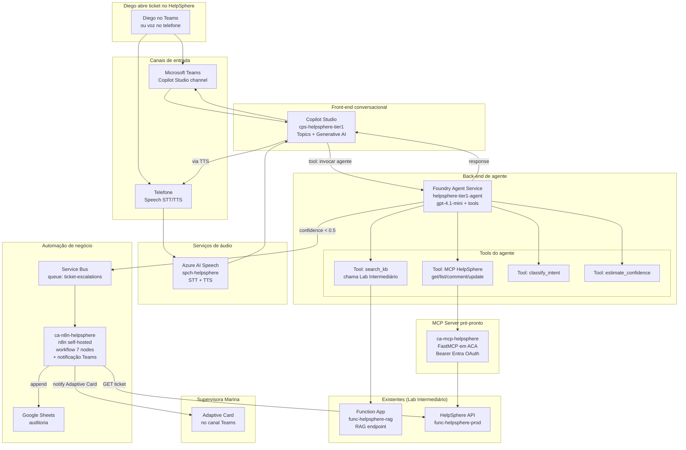

# Lab Final — Agente Autônomo + Workflow de Escalação
## Guia Passo-a-Passo no Azure Portal

> **Slides cobertos:** #25-#33 + #34-#38 (Blocos 4 + 5 — Agentes + Automação)
>
> **Disciplina 06** · **Lab 2 de 3** · **Duração estimada:** 9 horas · **Modalidade:** gravada · **Version-anchor:** Q2-2026
>
> **Cenário:** o RAG do Lab Intermediário cobre cerca de 40% dos tickets simples. Para chegar em 70%+ de auto-resolução, construímos agente híbrido (Copilot Studio + Foundry Agent Service) com tools, MCP, canal de voz, e workflow de escalação humana via n8n self-hosted em Azure Container Apps.

---

> ## ⚠️ CUSTO E FREE TRIAL
> | Item | Valor |
> |------|-------|
> | Custo mensal (recursos deixados rodando) | ~R$ 380/mês |
> | **Custo realista do lab (provisionar e deletar no mesmo dia)** | **R$ 22-30 saindo do bolso** |
> | Compatível com Free Trial USD 200? | **NÃO** — Foundry Agent Service + ACA exigem Pay-As-You-Go |
> | Custo se esquecer ligado 1 mês | R$ 380+/mês (ACA mais Speech rateado) |
>
> **Atenção especial:** Copilot Studio licenciamento separado — ver Passo 2.0. Para o lab, usaremos trial 30 dias gratuito do Copilot Studio.

---

## Pré-requisitos

- ✅ Lab Intermediário concluído (entendimento de RAG, Function App, métricas)
- ✅ `rg-helpsphere-ia` ainda existindo com Foundry Hub
- ✅ Quota Azure OpenAI com `gpt-4.1-mini` deployado (do Lab Intermediário) ou re-deploy neste lab
- ✅ Conta Microsoft 365 com permissão de criar agentes em Copilot Studio (ou trial 30 dias)
- ✅ Permissão para criar Service Principal e App Registration em Entra ID
- ✅ Docker Desktop instalado (para build da imagem MCP local antes do push para ACR)
- ✅ VS Code com extensão Azure Container Apps

### Recursos pré-prontos disponíveis (não implementar)

Esta disciplina entrega 2 componentes pré-prontos. Você **NÃO implementa** — apenas configura e usa:

1. **MCP Server HelpSphere** (`mcp-server/`)
   - Python + FastMCP + ACA-ready
   - Imagem Docker pública: `tftecr.azurecr.io/mcp-helpsphere:v1.0`
   - 4 tools: `get_ticket`, `list_tickets`, `add_comment`, `update_status`

2. **Workflow de escalação n8n** (`n8n-workflows/escalation-servicebus-sheets.json`)
   - Importável no n8n após provisão
   - 7 nodes determinísticos

### 🔗 Repositório companion (estado finalizado do Lab Final)

> **GitHub:** [`apex-helpsphere-agente-lab`](https://github.com/tftec-guilherme/apex-helpsphere-agente-lab) — repo público com código completo do agente + MCP server + workflows n8n + Speech config + tests. Use para:
>
> - **Fork-and-adapt** após completar o lab (substitua secrets pelos seus, faça `azd up`)
> - **Consulta** durante o lab quando travar em algum Passo
> - **Referência** do estado final esperado (compare com seu progresso)
>
> ⚠️ Este repo é um **scaffold inicial** (`v0.1.0-init`) — código completo será preenchido durante a gravação dos Blocos do Lab Final.

---

## Tabela de recursos que serão criados

| Recurso | Nome canônico | SKU/Tier | Custo mensal | Custo no lab |
|---|---|---|---|---|
| Resource Group | `rg-lab-final` | N/A | Gratuito | — |
| **Copilot Studio Agent** | `cps-helpsphere-tier1` | Trial 30 dias OR Premium licença | R$ 90/usuário (após trial) | gratuito (trial) |
| **Foundry Agent Service** | (no Project `aifproj-helpsphere-agente`) | gpt-4.1-mini consumption | varia | R$ 5-8 |
| Azure OpenAI deployment | `gpt-4.1-mini` (re-deploy ou compartilhado) | 30K TPM | varia | já contado no Lab Inter |
| Azure AI Speech | `spch-helpsphere` | S0 Standard | pago por uso | R$ 2-3 |
| ACA Environment | `cae-helpsphere-final` | — | R$ 0 (ambiente) | — |
| ACA n8n | `ca-n8n-helpsphere` | 0.5 vCPU, 1 Gi RAM, scale 0-1 | ~R$ 80 | R$ 3-4 |
| ACA MCP Server | `ca-mcp-helpsphere` | 0.5 vCPU, 1 Gi RAM, scale 0-1 | ~R$ 80 | R$ 3-4 |
| Azure Container Registry | `acrhelpsphere{rand}` | Basic | ~R$ 25 | R$ 1 |
| Azure Database PostgreSQL | `pg-n8n-{rand}` | Burstable B1ms | ~R$ 75 | R$ 3 |
| Service Bus | `sb-helpsphere-final` | Standard | ~R$ 55 | R$ 2 |
| Application Insights (compartilhado) | `ai-helpsphere-rag` (do Lab Inter) | Workspace-based | já criado | — |
| Entra App Registration MCP | `app-mcp-helpsphere-client` | — | gratuito | — |
| **Total** | | | **~R$ 380/mês ligado** | **R$ 22-30 lab realista** |

---

## Diagrama da arquitetura



---

## Estrutura do lab — 8 partes ao longo de 9 horas

| Parte | Duração | Atividade |
|---|---|---|
| Parte 1 | 15min | Provisionar fundação RG + ACR (ACA Environment foi movido para a Parte 4) |
| Parte 2 | 1.5h | Copilot Studio — agente + topics + canal Teams |
| Parte 3 | 2h | Foundry Agent Service — agent code-first + 4 tools |
| Parte 4 | 1.5h | ACA Environment + RBAC + MCP Server HelpSphere (deploy do pré-pronto em ACA) |
| Parte 5 | 1h | Azure AI Speech — canal de voz |
| Parte 6 | 1.5h | n8n self-hosted em ACA + workflow de escalação |
| Parte 7 | 1h | Service Bus + n8n notificação Teams + Google Sheets connector |
| Parte 8 | 30min | Demo end-to-end com 5 tickets + cleanup |

---

# Parte 1 — Provisionar fundação (30min)

## Passo 1.1 — Criar Resource Group

**No Portal Azure:**

1. Barra superior → buscar **"Resource groups"** → clicar
2. **+ Create**
3. Preencher tab **Basics**:
   - **Subscription:** sua
   - **Resource group:** `rg-lab-final`
   - **Region:** `East US 2`
4. Tab **Tags** (opcional, mas recomendado para cost tracking):
   - `cost-center` = `apex-helpsphere-ia`
   - `environment` = `lab`
   - `application` = `helpsphere-ia`
5. **Review + create** → **Create**
6. Aguardar provisioning ~15s até **Succeeded**

<!-- screenshot: passo-1.1-criar-resource-group-portal.png -->

> **Alternativa via Azure CLI (Linux/Mac/WSL — bash):**
>
> ```bash
> az login
> az group create \
>   --name rg-lab-final \
>   --location eastus2 \
>   --tags cost-center=apex-helpsphere-ia environment=lab application=helpsphere-ia
> ```

## Passo 1.2 — Criar Azure Container Registry

**No Portal Azure:**

1. Barra superior → buscar **"Container registries"** → clicar
2. **+ Create**
3. Preencher tab **Basics**:
   - **Subscription:** sua
   - **Resource group:** `rg-lab-final`
   - **Registry name:** `acrhelpsphere<rand>` (ex.: `acrhelpsphere8a3f2d` — deve ser globalmente único, sem hífen, lowercase, 5-50 chars)
   - **Location:** `East US 2`
   - **Pricing plan:** `Basic`
4. Tab **Authentication**:
   - **Admin user:** `Enabled` (para o lab — em produção use Managed Identity puro)
5. **Review + create** → **Create**
6. Aguardar provisioning ~1-2min até **Succeeded**

<!-- screenshot: passo-1.2-criar-acr-portal.png -->

> **Atenção custo:** ACR Basic cobra ~R$ 25/mês. Delete RG ao final.

> **Por que Basic?** Para o lab é suficiente. Em produção, use Standard ou Premium para geo-replication, content trust, etc.

> **Alternativa via Azure CLI (Linux/Mac/WSL — bash):**
>
> ```bash
> RAND=$(echo $RANDOM | md5sum | head -c 6)
> ACR_NAME="acrhelpsphere${RAND}"
>
> az acr create \
>   --name $ACR_NAME \
>   --resource-group rg-lab-final \
>   --sku Basic \
>   --admin-enabled true
>
> echo "ACR: $ACR_NAME"
> ```

## ✅ Checkpoint Parte 1

- [ ] RG `rg-lab-final` existe
- [ ] ACR `acrhelpsphere{rand}` existe

> **Nota:** o **ACA Environment** (`cae-helpsphere-final`) e o **RBAC AcrPull** da Managed Identity foram movidos para o **início da Parte 4** (Passos 4.4 e 4.5), porque o Portal Azure não permite criar um Container Apps Environment standalone sem associá-lo a um Container App. Criamos os dois juntos do primeiro Container App de fato (MCP Server).

---

# Parte 2 — Copilot Studio agent (1.5h)

## Passo 2.0 — Trial Copilot Studio

Copilot Studio é Power Platform, com licenciamento separado do Azure. Para esta disciplina:

1. Acesse **`copilotstudio.microsoft.com`**
2. Login com sua conta Microsoft 365 (corporativa ou trial)
3. Se primeiro acesso, ativar **30-day free trial**
4. Confirme que está em um environment de **Development** (não Default — Development tem permissões mais soltas)

> **Em produção real:** licenciamento Premium ~R$ 90/usuário/mês ou pay-as-you-go por mensagem. Para PoCs corporativos, trial é suficiente. Discussão detalhada em comitê — material no Apêndice E.

## Passo 2.1 — Criar agent

**No Copilot Studio Maker (copilotstudio.microsoft.com):**

1. Acesse **`https://copilotstudio.microsoft.com`** → entre no environment de **Development**
2. **Create** → **New agent** (a partir do "skeleton")
3. Preencher:
   - **Name:** `HelpSphere Tier 1 Agent`
   - **Description:** `Assistente de tier 1 da Apex HelpSphere — sugere respostas, escala para tier 2 quando necessário.`
   - **Language:** `Portuguese (Brazil)`
   - **Instructions:** (system prompt)
     ```
     Você é o assistente do tier 1 do HelpSphere da Apex Group, central de atendimento.
     Sua função é ajudar atendentes (ex.: Diego) a responder tickets de lojistas e colaboradores internos.

     Regras críticas:
     - Sempre responda em pt-BR a menos que o usuário escreva em outro idioma.
     - Sempre cite a fonte da informação.
     - Se a confidence da sua resposta for menor que 0.5, escale para tier 2.
     - Nunca prometa prazos abaixo de 24h.
     - Se ticket envolver dados pessoais sensíveis, peça redação humana.
     ```
4. **Confirm** para criar
5. Aguardar provisioning ~10-20s até agent abrir no canvas

<!-- screenshot: passo-2.1-criar-copilot-agent.png -->

> **Atenção licença:** Copilot Studio Trial é gratuito 30 dias. Após trial, cobrança ~R$ 90/usuário/mês (Premium) ou pay-as-you-go por mensagem.

## Passo 2.2 — Confirmar Generative mode + Knowledge sources

> **Nota Q2-2026:** novos agentes do Copilot Studio já nascem em **modo Generative por default**. Esse passo é mais **confirmação** do que configuração — provavelmente já está OK.

**No Copilot Studio Maker (agente aberto):**

### Sub-passo 2.2.1 — Confirmar modo Generative

1. Header do agente → ícone **⚙️ Settings** (ou menu **...** → **Settings**)
2. Tab **Generative AI** → seção **"Generative answers"**
3. Verificar:
   - ✅ **"Allow the AI to use general knowledge"** = ligado (= modo Generative free-flowing)
   - ❌ **"Only respond when a topic matches"** = desligado (= NÃO modo Classic)
4. Caminho alternativo: página inicial do agente → card **"Generative AI"** → **Configure**

> Se ambos switches já estão como descrito acima, **não há nada a fazer aqui** — pule pra 2.2.2.

### Sub-passo 2.2.2 — Confirmar Knowledge sources VAZIO

Na mesma página de Generative AI (ou em **Knowledge** no menu lateral, depende da versão UI):

1. Localize a seção **"Knowledge sources"**
2. **Deixe TODOS os toggles desligados / lista vazia.**

> **Por que vazio?** O conhecimento técnico do HelpSphere virá via **Foundry Agent como Tool/Plugin** (Parte 3 + Parte 4 MCP) — não como knowledge source nativo do Copilot Studio. Misturar os 2 mecanismos confunde o routing do agente.

### Sub-passo 2.2.3 — Persistência (não há "Save")

Mudanças em Settings / Generative AI do Copilot Studio Q2-2026 **persistem automaticamente** quando você sai da página. Não procure botão "Save" — não existe mais nessa tela (diferente de Topics, que ainda têm Save explícito).

<!-- screenshot: passo-2.2-generative-ai-mode.png -->

> **Surpresa Q2-2026 catalogada:** UI anterior tinha "Menu lateral → Generative AI" + botão Save explícito. Atual usa **Settings header (⚙️) → Generative AI** + auto-persist. Ver `docs/_disclaimers.md`.

## Passo 2.3 — Criar Topic estruturado para "Saudação"

Topics são fluxos guiados. Criamos um para padronizar saudação inicial.

**No Copilot Studio Maker — agente aberto no canvas:**

1. Menu lateral → **Topics** → **+ New topic** → **Create from blank**
2. Preencher:
   - **Topic name:** `Saudacao_inicial`
   - **Trigger phrases:**
     - `oi`
     - `olá`
     - `bom dia`
     - `boa tarde`
     - `boa noite`
   - **Trigger by message:** `Yes`
3. No canvas do topic, adicionar nodes:
   - **+ Add node** → **Send a message** → texto: `Olá! Sou o assistente do HelpSphere. Em que posso ajudar com seu ticket?`
4. **Save**

<!-- screenshot: passo-2.3-topic-saudacao.png -->

## Passo 2.4 — Criar Topic "Resolver_ticket"

Esse é o topic principal — ele chama o Foundry Agent (criado na Parte 3) via custom action.

**No Copilot Studio Maker — agente aberto no canvas:**

### Sub-passo 2.4.1 — Criar o topic

1. Menu lateral → **Topics** → **+ Add a topic** → **From blank** (em algumas UIs aparece como `+ New topic → Create from blank`)
2. **Topic name** (canto superior esquerdo): `Resolver_ticket`

### Sub-passo 2.4.2 — Configurar o trigger via Description (sem dropdown "Description-based")

A UI Q2-2026 **não tem mais dropdown "Description-based"**. O orquestrador Generative AI usa o campo **Description** do node Trigger automaticamente.

1. No canvas, **clique no primeiro node "Trigger"** (já existe — não precisa adicionar)
2. Painel da direita abre com 2 campos principais:
   - **Phrases:** deixe **VAZIO** (não adicione frases de gatilho)
   - **Description:** cole exatamente:
     ```
     Use este topic quando o usuário descreve um problema ou pergunta sobre um ticket específico do HelpSphere.
     ```
3. Se aparecer dropdown **"Trigger by"** com opções `Phrases` / `Event` / `Activity` → mantenha `Phrases` (mesmo sem frases preenchidas). A **Description** é o que o Generative AI consulta no modo orquestrador.

> **Por que isso funciona:** com o agente em modo **Generative AI** (Passo 2.2), o orquestrador faz **semantic match** da pergunta do usuário contra a `Description` de cada topic. Não precisa de phrases nem dropdown explícito.

### Sub-passo 2.4.3 — Adicionar node "Ask a question"

1. Abaixo do node Trigger, clique no **+** (adicionar node)
2. No menu que abre, procure por **"Ask a question"**:
   - Se não aparecer direto, clique **"See more"** no rodapé do menu OU digite `ask` no campo de busca
3. Selecione **"Ask a question"** → painel direita:
   - **Question:** `Qual o problema do ticket que você precisa de ajuda?`
   - **Identify:** `User's entire response` (dropdown — escolhe a resposta inteira como entidade)
   - **Save response as:** `userQuery` (cria a variável automaticamente)

### Sub-passo 2.4.4 — Adicionar node "Call an action" (placeholder)

1. Abaixo do node "Ask a question", clique no **+** novamente
2. No menu, procure **"Call an action"**:
   - Localização atual: categoria **"Advanced"** OU digite `call` no campo de busca
   - Em algumas UIs aparece agrupado como **"Add a tool"** ou **"Call a Power Automate flow"** — selecione o que tiver `Call an action` ou `tool` no nome
3. **Deixe como placeholder** — não configure a action agora. Será preenchido no **Passo 8.1** (após criar o Foundry Agent na Parte 3 + MCP na Parte 4)

### Sub-passo 2.4.5 — Salvar

1. Botão **Save** (canto superior direito do canvas do topic)
2. Aguarde toast "Topic saved" antes de fechar

<!-- screenshot: passo-2.4-topic-resolver-ticket.png -->

> **Surpresa Q2-2026 catalogada:** UI anterior tinha dropdown explícito **"Trigger: Description-based"** + nodes "Ask a question" / "Call an action" visíveis no menu raiz. Atual usa **campo Description no node Trigger** (orquestrador implícito) + nodes agrupados sob categorias com **"See more"** ou busca. Ver `docs/_disclaimers.md` SUR-CS-Q2-2026-TOPICS.

Volte na Parte 2 após Parte 3 (configurar a Call an action).

## Passo 2.5 — Configurar canal Teams (volte aqui após Parte 3)

> Esse passo **depende** de você ter feito Parte 3 (Foundry Agent) e Parte 4 (MCP) primeiro.

**No Copilot Studio Maker — agente aberto no canvas:**

1. Menu lateral → **Channels**
2. Card **Microsoft Teams** → **+ Add channel**
3. **Confirm** — Copilot Studio gera um App package
4. **Open in Teams admin** → instalar para a organização (admin precisa aprovar) OU para si mesmo via **Test in Teams**
5. Após aprovado/testado, agent fica acessível como bot Teams

<!-- screenshot: passo-2.5-canal-teams.png -->

> **Atenção licença Teams:** instalação org-wide exige role Microsoft 365 Tenant Admin. Para o lab, use **Test in Teams** (sem admin necessário).

## ✅ Checkpoint Parte 2 (parcial — completa após Parte 3)

- [ ] Agent `HelpSphere Tier 1 Agent` criado
- [ ] Generative AI mode ativo
- [ ] Topic `Saudacao_inicial` criado e testado
- [ ] Topic `Resolver_ticket` criado (sem ação ainda)

---

# Parte 3 — Foundry Agent Service (2h)

## Passo 3.1 — Criar Foundry Project dedicado

**No Azure AI Foundry portal (ai.azure.com):**

1. Acesse `https://ai.azure.com` → entre no Hub `aifhub-apex-prod` (criado no Bloco 2)
2. **+ New project**
3. Preencher:
   - **Project name:** `aifproj-helpsphere-agente`
   - **Hub:** `aifhub-apex-prod` (já selecionado)
4. **Create**
5. Aguardar provisioning ~1-2min até project abrir

<!-- screenshot: passo-3.1-criar-foundry-project.png -->

## Passo 3.2 — Confirmar deployment gpt-4.1-mini

**No Azure AI Foundry portal (ai.azure.com):**

1. Entre no Project `aifproj-helpsphere-agente`
2. Menu lateral → **Models + endpoints**
3. Verifique se já existe deployment `gpt-4.1-mini` (compartilhado do Lab Intermediário)
4. Se NÃO existe:
   - **+ Deploy model** → buscar `gpt-4.1-mini` → **Confirm**
   - **Deployment name:** `gpt-4.1-mini`
   - **Deployment type:** `Standard`
   - **Tokens per Minute Rate Limit:** `30K`
   - **Deploy**
   - Aguardar ~1min até **Succeeded**
5. Anote da página do deployment:
   - **Target URI** (endpoint)
   - **Key** (API key)

<!-- screenshot: passo-3.2-confirmar-deployment-gpt41mini.png -->

> **Atenção custo:** `gpt-4.1-mini` cobra por 1M tokens (input + output). Para o lab, R$ 5-8 com cap em 30K TPM.

## Passo 3.3 — Registrar agent no Foundry (via SDK Python)

> **Código já está no repo.** Clone (ou `git pull`) o `apex-helpsphere-agente-lab` e abra `agent-code/create_agent.py`. O arquivo registra o agent no Foundry Agent Service com 4 tools + system prompt — você não digita 122 linhas, só configura e roda. Há **1 TODO marcado** (`SYSTEM_PROMPT`) que você customiza durante o lab.

### Estrutura `agent-code/`

```
agent-code/
├── create_agent.py             # ESTE PASSO — registra agent + 4 tools + SYSTEM_PROMPT (TODO)
├── agent_runner.py             # Passo 3.5 — handlers das tools + event loop
├── requirements.txt            # azure-ai-projects + azure-identity + azure-servicebus + openai + requests
├── README.md
└── func-agent-runner/          # Passo 3.6 — wrapper Function App HTTP
```

### O que `create_agent.py` faz

Chama `client.create_agent()` (SDK `azure-ai-agents` v1 GA) registrando 4 tools com schemas JSON (formato OpenAI function calling):

| Tool | O que faz | Backend |
|------|-----------|---------|
| `search_kb` | Busca no kb corporativo (manuais, FAQs, políticas) com citações + confidence | Function App RAG (Lab Intermediário) |
| `get_ticket` | Recupera ticket completo por ID | MCP Server (Parte 4) |
| `list_similar_tickets` | Tickets resolvidos da mesma categoria | MCP Server (Parte 4) |
| `escalate_ticket` | Dispara workflow n8n com motivo + confidence | Service Bus topic (Parte 7) |

> **TODO pedagógico:** abra o arquivo na seção `SYSTEM_PROMPT` (próximo à linha 95). O texto baseline orienta o agent a usar `search_kb` primeiro, escalar quando `confidence < 0.5`, citar fontes e responder em pt-BR. Customize tom, regras de negócio da HelpSphere fictícia, limite de palavras, SLAs — o que fizer sentido para a turma.

> **Nota SDK:** o Foundry mudou em Q2-2026 para **Foundry Direct Projects**. SDK GA atual: `azure-ai-agents>=1.0.0` + `azure-ai-projects>=2.1.0`. O constructor usa **endpoint URI direto** (formato `https://<hub>.services.ai.azure.com/api/projects/<project>`), NÃO mais a `connection string` legacy `<region>.api.azureml.ms;...` que o SDK preview `1.0.0b9` exigia.

## Passo 3.4 — Setup env vars e rodar

Pegue o **endpoint URI do seu Project** no Portal Foundry (em **ai.azure.com → Project aberto → Project endpoint** na barra lateral). Formato:

```
https://<hub-name>.services.ai.azure.com/api/projects/<project-name>
```

```powershell
cd agent-code
python -m venv .venv
.\.venv\Scripts\Activate.ps1
pip install -r requirements.txt

# Endpoint URI do Foundry Direct Project
$env:AI_PROJECT_ENDPOINT = "https://<hub-name>.services.ai.azure.com/api/projects/<project-name>"

# URLs/keys do Lab Intermediário
$env:RAG_FUNCTION_URL = "https://func-helpsphere-rag-{rand}.azurewebsites.net"
$env:RAG_FUNCTION_KEY = "<key>"

# MCP server URL — vamos definir depois da Parte 4. Por enquanto, placeholder:
$env:MCP_SERVER_URL = "https://placeholder"

python create_agent.py
```

Saída:

```
[+] Agent criado: asst_xxxxxxx
    Model: gpt-4.1-mini
    Tools: 4
    Anote esse ID — usado no Copilot Studio (Passo 2.5) e no Function App (Passo 3.6).
```

Anote o `agent.id` (formato `asst_xxxxxxx`) — você vai usar no Copilot Studio E como env var `AGENT_ID` no Function App da próxima parte.

## Passo 3.5 — Handler de tools + event loop

> **Código já está no repo.** Abra `agent-code/func-agent-runner/agent_runner.py`. O arquivo implementa os 4 handlers reais + função `run_agent(thread_id, user_message)` que orquestra o loop completo (user message → tool calls → tool outputs → resposta final). Há **1 TODO marcado** (`ESCALATION_THRESHOLD`).
>
> **Por que dentro de `func-agent-runner/`?** O `func azure functionapp publish` da Parte 3.6 zipa **apenas a pasta atual**. Como o `function_app.py` faz `from agent_runner import ...`, o helper precisa estar lado-a-lado dele. Se o arquivo ficar na pasta pai, o worker Python falha com `ModuleNotFoundError: No module named 'agent_runner'`.

### O que `agent_runner.py` faz

O Passo 3.3 registrou apenas o **schema** das 4 tools. Aqui está a **implementação** de cada uma + o event loop que o agent invoca:

| Função | Conecta em | Lógica resumida |
|--------|-----------|-----------------|
| `tool_search_kb(query, ticket_id)` | RAG Function App | `POST {RAG_URL}/api/search?code={key}` com payload `{query, ticket_id}` → retorna `{suggestion, citations, confidence}` |
| `tool_get_ticket(ticket_id)` | MCP Server | `POST {MCP_URL}/tools/get_ticket` com `Authorization: Bearer {MCP_TOKEN}` |
| `tool_list_similar(category, limit)` | MCP Server | `POST {MCP_URL}/tools/list_tickets` filtrando `status="Resolved"` |
| `tool_escalate(ticket_id, reason, confidence)` | Service Bus topic `escalations` | Publica mensagem JSON; n8n consome (Parte 6/7) |
| `run_agent(thread_id, msg)` | Foundry | Loop: cria run → enquanto `requires_action` → despacha tools → submete outputs → retorna texto final |

### TODO pedagógico — `ESCALATION_THRESHOLD`

Procure por `ESCALATION_THRESHOLD = 0.5` (linha ~36). Esse é o limite abaixo do qual o agent escala automaticamente. Trade-offs para discutir com a turma:

- `0.3` → agente confia mais em si (escala menos, risco maior de resposta ruim)
- `0.5` → baseline equilibrada
- `0.7` → agente cético (escala mais, custo maior em tier 2)

Qual valor faz sentido para a HelpSphere fictícia? Ajuste no arquivo + redeploy no Passo 3.6.

### Smoke local opcional

```powershell
# Ainda em agent-code/ com .venv ativo + env vars setadas + AGENT_ID anotado:
$env:AGENT_ID = "asst_xxxxxxx"
python agent_runner.py
```

Saída esperada: `Thread criada: thread_xxxxxx` + resposta do agent ao prompt de smoke.

## Passo 3.6 — Deploy do runner como Function App

Para integração com Copilot Studio, o runner precisa estar acessível por HTTP. Vamos empacotar como Function App.

> **Código já está no repo.** Abra `agent-code/func-agent-runner/`. A pasta contém os 3 arquivos prontos para `func azure functionapp publish`:

```
agent-code/func-agent-runner/
├── function_app.py     # Wrapper HTTP minimal: POST /agent/chat → run_agent()
├── host.json           # Bundle Functions v4 + Application Insights
└── requirements.txt    # azure-functions + azure-ai-projects + azure-identity + azure-servicebus + openai + requests
```

### O que `function_app.py` faz

Wrapper HTTP enxuto (~25 linhas) que:

1. Recebe `POST /api/agent/chat` com body `{message, thread_id?}`
2. Se `thread_id` vazio, cria uma thread nova no Foundry
3. Chama `run_agent(thread_id, message)` (importado de `agent_runner.py` da pasta pai)
4. Retorna `{thread_id, response}` em JSON

`http_auth_level=FUNCTION` — Copilot Studio precisa do `?code={functionKey}` na URL.

> **Importante:** o `requirements.txt` desta pasta DEVE incluir `azure-servicebus` (o `agent_runner.tool_escalate` usa). Já vem certo no repo.

**Deploy: Criar Function App via Portal Azure**

**No Portal Azure:**

1. Barra superior → buscar **"Function App"** → clicar
2. **+ Create** → escolher hosting plan **Consumption**
3. Preencher tab **Basics**:
   - **Subscription:** sua
   - **Resource group:** `rg-lab-final`
   - **Function App name:** `func-helpsphere-agent-<rand>` (ex.: `func-helpsphere-agent-8a3f2d`)
   - **Runtime stack:** `Python`
   - **Version:** `3.11`
   - **Region:** `East US 2`
   - **Operating System:** `Linux`
4. Tab **Storage**:
   - **Storage account:** selecione um existente OU **Create new** com nome auto-gerado
5. Tab **Networking**: deixe defaults (public)
6. Tab **Monitoring**: deixe Application Insights `Enabled` (auto-criado)
7. **Review + create** → **Create**
8. Aguardar provisioning ~3-5min até **Succeeded**

<!-- screenshot: passo-3.6-criar-function-app-portal.png -->

> **Atenção custo:** Function App Consumption cobra ~R$ 0,50 por milhão de execuções + R$ 0,000016 por GB-segundo. Para o lab é praticamente gratuito.

**Configurar app settings (env vars) via Portal:**

1. Function App `func-helpsphere-agent-<rand>` → menu **Settings** → **Environment variables** → **App settings**
2. **+ Add** cada variável:
   - `AI_PROJECT_ENDPOINT` = `https://<hub>.services.ai.azure.com/api/projects/<project>`
   - `AGENT_ID` = `<asst_xxxxxxx>`
   - `RAG_FUNCTION_URL` = `<URL do Lab Intermediário>`
   - `RAG_FUNCTION_KEY` = `<key>`
   - `MCP_SERVER_URL` = `<a-definir-na-Parte-4>`
   - `MCP_TOKEN` = `<a-definir-na-Parte-4>`
   - `AzureWebJobsFeatureFlags` = `EnableWorkerIndexing` — **obrigatória em Flex Consumption** para o host descobrir o `@app.route` do `function_app.py` (programming model Python v2). Sem ela, deploy completa mas `az functionapp function list` retorna vazio.
3. **Apply** (rolar até o topo) → **Confirm**
4. Aguardar restart ~30s

<!-- screenshot: passo-3.6-app-settings-portal.png -->

**Deploy do código (CLI local — não tem caminho Portal puro):**

```powershell
Set-Location func-agent-runner/
func azure functionapp publish func-helpsphere-agent-<rand> --python
```

> **Linux/Mac/WSL:** troque `Set-Location` por `cd`.

> **Alternativa via Azure CLI (Linux/Mac/WSL — bash, criação do recurso):**
>
> ```bash
> # Criar Function App
> FUNC_AGENT_NAME="func-helpsphere-agent-${RAND}"
> az functionapp create \
>   --name $FUNC_AGENT_NAME \
>   --resource-group rg-lab-final \
>   --runtime python \
>   --runtime-version 3.11 \
>   --consumption-plan-location eastus2 \
>   --storage-account $STORAGE_NAME
>
> # Configurar env vars
> az functionapp config appsettings set \
>   --name $FUNC_AGENT_NAME \
>   --resource-group rg-lab-final \
>   --settings \
>     AI_PROJECT_ENDPOINT="https://<hub>.services.ai.azure.com/api/projects/<project>" \
>     AGENT_ID="<asst_id>" \
>     RAG_FUNCTION_URL="<...>" \
>     RAG_FUNCTION_KEY="<...>" \
>     MCP_SERVER_URL="<a-definir>" \
>     MCP_TOKEN="<a-definir>" \
>     AzureWebJobsFeatureFlags="EnableWorkerIndexing"
>
> # Deploy
> cd func-agent-runner/
> func azure functionapp publish $FUNC_AGENT_NAME --python
> ```

## ✅ Checkpoint Parte 3

- [ ] Project `aifproj-helpsphere-agente` criado
- [ ] Agent `helpsphere-tier1-agent` registrado com 4 tools
- [ ] `agent_runner.py` testado localmente (uma run completa)
- [ ] Function App `func-agent-runner` deployada e acessível

---

# Parte 4 — MCP Server HelpSphere (deploy do pré-pronto) (1h)

> O código fonte do MCP está em `mcp-server/` (do repo `apex-helpsphere-agente-lab` clonado localmente). **Você não implementa** — apenas builda a imagem, deploya em ACA, e configura conexão no agent.

## Passo 4.1 — Estrutura do MCP Server pré-pronto

> **Código já está no repo.** Abra `mcp-server/` (do `apex-helpsphere-agente-lab` clonado). Você não implementa o MCP — apenas builda a imagem, deploya em ACA, e configura conexão no agent. Há **1 TODO marcado** (`ticket_resource`) que você pode customizar.

```
mcp-server/
├── server.py            # FastMCP + 4 tools com @require_scope + 1 resource (TODO em ticket_resource)
├── auth.py              # Validação JWT Entra + decorator require_scope (~55L)
├── helpsphere_db.py     # Wrapper SQL HelpSphere com 4 ops (~90L)
├── Dockerfile           # Base python:3.11-slim + msodbcsql18 + WORKDIR /app + ENTRYPOINT
├── requirements.txt     # fastmcp + pyodbc + pyjwt[crypto] + requests + azure-identity
└── README.md            # Build + deploy ACA + troubleshooting
```

### As 4 tools expostas (`server.py`)

| Tool | Scope Entra requerido | Operação SQL |
|------|----------------------|---------------|
| `get_ticket(ticket_id)` | `helpsphere.tickets.read` | `SELECT ... FROM tickets WHERE id = ?` |
| `list_tickets(status, limit, category?)` | `helpsphere.tickets.read` | `SELECT TOP (?) ... WHERE status = ? [AND category = ?] ORDER BY created_at DESC` |
| `add_comment(ticket_id, comment, author)` | `helpsphere.tickets.write` | `INSERT INTO comments (...)` |
| `update_status(ticket_id, new_status)` | `helpsphere.tickets.write` | `UPDATE tickets SET status = ?, updated_at = SYSUTCDATETIME() WHERE id = ?` |

+ 1 resource `helpsphere://tickets/{ticket_id}` que retorna o ticket serializado (formato customizável via TODO).

### Como `auth.py` valida o token

`@require_scope("helpsphere.tickets.read")` é um decorator que envolve cada tool:

1. Lê o `bearer_token` do contexto MCP
2. Busca a `kid` correta no JWKS endpoint do Entra ID (`login.microsoftonline.com/.../discovery/v2.0/keys`)
3. Valida assinatura RS256 + audience (`EXPECTED_AUDIENCE` env) + issuer (tenant)
4. Confere que `scp` (scopes) do token contém o scope requerido pela tool
5. Se tudo passa → invoca a função real; senão → `PermissionError`

> **TODO pedagógico:** abra `server.py` em `ticket_resource()` (~linha 64). A implementação atual retorna `str(dict)` cru. Sugestões para expandir: incluir últimos N comentários (`helpsphere_db.list_comments`), adicionar SLA metadata por priority, formatar como Markdown.

## Passo 4.2 — Build da imagem Docker

```powershell
Set-Location mcp-server/

# Capturar nome do ACR criado no Passo 1.2 (era acrhelpsphere{rand})
$AcrName = az acr list -g rg-lab-final --query "[0].name" -o tsv

az acr build `
  --registry $AcrName `
  --image mcp-helpsphere:v1 `
  --file Dockerfile `
  .
```

> **Linux/Mac/WSL:** troque `Set-Location` por `cd`, `` ` `` (backtick) por `\` (backslash), e `$AcrName` por `$ACR_NAME`.

Tempo: ~3-5min. Verifique:
```powershell
az acr repository list --name $AcrName --output table
```

Deve listar `mcp-helpsphere`.

## Passo 4.3 — Criar App Registration para auth

**No Portal Azure:**

1. Barra superior → buscar **"Microsoft Entra ID"** → clicar
2. Menu lateral → **App registrations** → **+ New registration**
3. Preencher:
   - **Name:** `app-mcp-helpsphere-server`
   - **Supported account types:** `Accounts in this organizational directory only (Single tenant)`
   - **Redirect URI:** deixar vazio (server-side only)
4. **Register**
5. Anote da **Overview** page:
   - **Application (client) ID** — vamos chamar de `MCP_SERVER_APP_ID`
   - **Directory (tenant) ID**

<!-- screenshot: passo-4.3-app-reg-server-portal.png -->

**Definir Application ID URI:**

1. App reg `app-mcp-helpsphere-server` → menu **Expose an API**
2. **Application ID URI** → **Add** → o Portal pré-preenche `api://<APP_ID>` (GUID anotado no Passo 4.3 step 5) → **Save**

<!-- screenshot: passo-4.3-app-id-uri.png -->

> [!IMPORTANT] **Identifier URI policy — default vs custom**
>
> Tenants Entra ID corporativos (incluindo trial/MSDN) têm **default policy** que bloqueia URIs custom sem domínio verificado. Erro típico se você tentar `api://mcp-helpsphere`:
>
> > Failed to add identifier URI api://mcp-helpsphere. All newly added URIs must contain a tenant verified domain, tenant ID, or app ID, as per the default tenant policy of your organization.
>
> **3 formas aceitas pelo default policy:**
> 1. ✅ **`api://<APP_ID>`** (recomendado — funciona em qualquer tenant, sem setup adicional)
> 2. ✅ **`api://<TENANT_ID>/<custom>`** (ex: `api://12345.../mcp-helpsphere`)
> 3. ✅ **`api://<verified-domain>/<custom>`** (ex: `api://apex.com.br/mcp-helpsphere`, se domínio verificado no tenant)
>
> **Workaround tentador (não recomendado):** setar `requestedAccessTokenVersion=2` no manifest pode relaxar a restrição em alguns tenants, mas depende de policy custom configurada pelo admin — não é portável.
>
> **Decisão deste lab:** usamos `api://<APP_ID>` (forma 1) porque funciona universalmente. Todas as referências `api://mcp-helpsphere` em outros Passos deste guia devem ser substituídas pelo valor `api://<MCP_SERVER_APP_ID>` que você anotou no step 5 acima. Para escopos use `api://<MCP_SERVER_APP_ID>/helpsphere.tickets.read` etc.

**Adicionar scopes:**

1. Ainda em **Expose an API** → **+ Add a scope**
2. Preencher (3 vezes, um por scope):
   - **Scope 1:**
     - Scope name: `helpsphere.tickets.read`
     - Who can consent: `Admins and users`
     - Admin consent display name: `Read tickets`
     - Admin consent description: `Permite ler dados de tickets`
     - State: `Enabled`
     - **Add scope**
   - **Scope 2:** `helpsphere.tickets.write` — display `Write tickets`, descrição `Permite criar/editar tickets`
   - **Scope 3:** `helpsphere.kb.read` — display `Read KB`, descrição `Permite ler base de conhecimento`

<!-- screenshot: passo-4.3-scopes.png -->

> **Alternativa via Azure CLI (Linux/Mac/WSL — bash):**
>
> ```bash
> APP_NAME="app-mcp-helpsphere-server"
>
> # Passo 1: criar app sem identifier-uri (vamos definir depois com api://<APP_ID>)
> APP_OBJECT_ID=$(az ad app create \
>   --display-name $APP_NAME \
>   --query id -o tsv)
>
> APP_ID=$(az ad app show --id $APP_OBJECT_ID --query appId -o tsv)
>
> # Passo 2: setar identifier-uri usando o APP_ID (passa default tenant policy)
> az ad app update --id $APP_OBJECT_ID --identifier-uris "api://$APP_ID"
>
> echo "MCP Server app ID: $APP_ID"
> echo "Identifier URI:   api://$APP_ID"
> ```
>
> **PowerShell equivalente:**
> ```powershell
> $AppName = "app-mcp-helpsphere-server"
> $AppObjectId = az ad app create --display-name $AppName --query id -o tsv
> $AppId = az ad app show --id $AppObjectId --query appId -o tsv
> az ad app update --id $AppObjectId --identifier-uris "api://$AppId"
> Write-Host "MCP Server app ID: $AppId"
> Write-Host "Identifier URI:   api://$AppId"
> ```
>
> (Scopes ainda precisam ser adicionados via Portal — `az ad app` não tem comando direto para `oauth2PermissionScopes`.)

## Passo 4.4 — Criar ACA Environment

> **Nota pedagógica (Q2-2026):** o Portal Azure **não permite** criar um Container Apps Environment standalone sem associar a um Container App. Por isso fazemos a criação do Environment **junto** com o primeiro Container App (Passo 4.6) ou usando o caminho específico **"Container Apps Environments"** (plural) no Marketplace.

**Opção A — via Portal (caminho direto):**

1. Acesse `https://portal.azure.com/#create/Microsoft.ManagedEnvironment` (link direto pro blade do Environment standalone)
2. Preencher tab **Basics**:
   - **Subscription:** sua
   - **Resource group:** `rg-lab-final`
   - **Environment name:** `cae-helpsphere-final`
   - **Region:** `East US 2`
3. Tab **Monitoring**:
   - **Logs destination:** `Azure Log Analytics`
   - **Log Analytics workspace:** selecione `log-helpsphere-ia` do RG `rg-helpsphere-ia` (compartilhado, criado no Bloco 2)
4. Tab **Networking**: deixe defaults (managed network, public)
5. **Review + create** → **Create**
6. Aguardar provisioning ~3-5min até **Succeeded**

<!-- screenshot: passo-4.4-criar-aca-environment-portal.png -->

> **Atenção:** o ACA Environment usa o Log Analytics Workspace do `rg-helpsphere-ia` (compartilhado, criado no Bloco 2). Se ainda não criou esse RG/workspace, faça o Bloco 2 antes.

**Opção B — via Azure CLI (alternativa mais rápida) — PowerShell:**

```powershell
$WorkspaceId = az monitor log-analytics workspace show `
  --resource-group rg-helpsphere-ia `
  --workspace-name log-helpsphere-ia `
  --query customerId -o tsv

$WorkspaceKey = az monitor log-analytics workspace get-shared-keys `
  --resource-group rg-helpsphere-ia `
  --workspace-name log-helpsphere-ia `
  --query primarySharedKey -o tsv

az containerapp env create `
  --name cae-helpsphere-final `
  --resource-group rg-lab-final `
  --location eastus2 `
  --logs-workspace-id $WorkspaceId `
  --logs-workspace-key $WorkspaceKey
```

> **Linux/Mac/WSL:** troque `$Var = az ...` por `VAR=$(az ...)`, `` ` `` (backtick) por `\` (backslash), e `$VarName` por `$VAR_NAME` em referências.

**Opção C — durante o Passo 4.6 (Create Container App):** ao escolher o Environment no dropdown, clicar **+ Create new** e preencher inline. Funciona, mas dá menos visibilidade do que aconteceu no Environment standalone.

## Passo 4.5 — Atribuir RBAC AcrPull ao Managed Identity (do Bloco 2)

A Managed Identity `mi-helpsphere-ia` (criada no Bloco 2 em `rg-helpsphere-ia`) precisa de role `AcrPull` no ACR `acrhelpsphere{rand}` (criado no Passo 1.2) para que o Container App consiga puxar a imagem privada.

```powershell
$PrincipalId = az identity show `
  --name mi-helpsphere-ia `
  --resource-group rg-helpsphere-ia `
  --query principalId -o tsv

$AcrName = az acr list -g rg-lab-final --query "[0].name" -o tsv
$AcrId = az acr show --name $AcrName --resource-group rg-lab-final --query id -o tsv

az role assignment create `
  --assignee $PrincipalId `
  --role AcrPull `
  --scope $AcrId
```

> **Linux/Mac/WSL:** troque `$Var = az ...` por `VAR=$(az ...)` e `` ` `` por `\`.

## Passo 4.6 — Deploy MCP Server em Container App

**No Portal Azure:**

1. Barra superior → buscar **"Container Apps"** → clicar
2. **+ Create** → **Container App**
3. Preencher tab **Basics**:
   - **Subscription:** sua
   - **Resource group:** `rg-lab-final`
   - **Container app name:** `ca-mcp-helpsphere`
   - **Region:** `East US 2`
   - **Container Apps Environment:** `cae-helpsphere-final` (criado no Passo 4.4)
4. Tab **Container**:
   - **Use quickstart image:** `Off`
   - **Image source:** `Azure Container Registry`
   - **Registry:** `acrhelpsphere<rand>.azurecr.io` (criado no Passo 1.2)
   - **Image:** `mcp-helpsphere`
   - **Image tag:** `v1`
   - **CPU and Memory:** `0.5 CPU / 1 Gi memory`
   - **Environment variables:**
     - `HELPSPHERE_SQL_CONNECTION` = `<connection string do HelpSphere SQL>` — **veja a nota abaixo para obter este valor**
     - `AZURE_TENANT_ID` = `<seu tenant ID>` (Portal → Microsoft Entra ID → Overview → Tenant ID, OU `az account show --query tenantId -o tsv`)
     - `EXPECTED_AUDIENCE` = `api://<MCP_SERVER_APP_ID>` (mesmo Application ID URI definido no Passo 4.3 — substitua `<MCP_SERVER_APP_ID>` pelo GUID do app reg)

> **Connection string `HELPSPHERE_SQL_CONNECTION` (AAD + MI — sem senha):**
>
> ```powershell
> # Capturar FQDN do SQL Server do stack apex-helpsphere
> $SqlFqdn = az sql server list -g rg-helpsphere-saas --query "[0].fullyQualifiedDomainName" -o tsv
> ```
>
> Cole no env var `HELPSPHERE_SQL_CONNECTION` (substitua `<FQDN>` pelo output acima):
>
> ```text
> Driver={ODBC Driver 18 for SQL Server};Server=tcp:<FQDN>,1433;Database=helpsphere;Authentication=ActiveDirectoryMsi;Encrypt=yes;
> ```
>
> O Container App autentica via `mi-helpsphere-ia` (anexada no Tab Identity, step 6 acima). A MI já tem grants no DB porque você fez isso no Lab Intermediário.

5. Tab **Ingress**:
   - **Ingress:** `Enabled`
   - **Ingress traffic:** `Accepting traffic from anywhere`
   - **Target port:** `8080`
6. Tab **Identity**:
   - **User-assigned managed identity:** **+ Add** → selecionar `mi-helpsphere-ia` (do RG `rg-helpsphere-ia`, criado no Bloco 2)
7. Tab **Scaling**:
   - **Min replicas:** `0`
   - **Max replicas:** `1`
8. **Review + create** → **Create**
9. Aguardar provisioning ~2-3min até **Succeeded**

<!-- screenshot: passo-4.4-deploy-aca-mcp-portal.png -->

> **Atenção custo:** ACA cobra ~R$ 80/mês com scale-to-zero. No lab realista (provisiona+deleta no dia), R$ 3-4.

**Após criado, anotar URL:**

1. Container app `ca-mcp-helpsphere` → **Overview**
2. Anote **Application Url** (formato `https://ca-mcp-helpsphere.<region-fqdn>.azurecontainerapps.io`) — vamos chamar de `MCP_URL`
3. URL completa do MCP endpoint: `${MCP_URL}/mcp`

<!-- screenshot: passo-4.4-mcp-url-anotar.png -->

> **Alternativa via Azure CLI (Linux/Mac/WSL — bash):**
>
> ```bash
> HELPSPHERE_SQL_CONN="<connection-string-do-HelpSphere-SQL>"
>
> az containerapp create \
>   --name ca-mcp-helpsphere \
>   --resource-group rg-lab-final \
>   --environment cae-helpsphere-final \
>   --image $ACR_NAME.azurecr.io/mcp-helpsphere:v1 \
>   --target-port 8080 \
>   --ingress external \
>   --registry-server $ACR_NAME.azurecr.io \
>   --registry-identity $(az identity show -n mi-helpsphere-ia -g rg-helpsphere-ia --query id -o tsv) \
>   --user-assigned $(az identity show -n mi-helpsphere-ia -g rg-helpsphere-ia --query id -o tsv) \
>   --env-vars \
>     HELPSPHERE_SQL_CONNECTION="$HELPSPHERE_SQL_CONN" \
>     AZURE_TENANT_ID="<seu-tenant-id>" \
>     EXPECTED_AUDIENCE="api://mcp-helpsphere" \
>   --min-replicas 0 \
>   --max-replicas 1 \
>   --cpu 0.5 \
>   --memory 1Gi
>
> MCP_URL=$(az containerapp show \
>   --name ca-mcp-helpsphere \
>   --resource-group rg-lab-final \
>   --query "properties.configuration.ingress.fqdn" -o tsv)
>
> echo "MCP Server URL: https://$MCP_URL/mcp"
> ```

## Passo 4.7 — Criar App Registration cliente (para o agent autenticar)

**No Portal Azure:**

1. Barra superior → buscar **"Microsoft Entra ID"** → clicar
2. Menu lateral → **App registrations** → **+ New registration**
3. Preencher:
   - **Name:** `app-mcp-helpsphere-client`
   - **Supported account types:** `Accounts in this organizational directory only (Single tenant)`
   - **Redirect URI:** deixar vazio (client-credentials flow only)
4. **Register**
5. Anote da **Overview** page:
   - **Application (client) ID** — vamos chamar de `CLIENT_APP_ID`

<!-- screenshot: passo-4.5-app-reg-client-portal.png -->

**Criar Client Secret:**

1. App reg `app-mcp-helpsphere-client` → menu **Certificates & secrets** → tab **Client secrets**
2. **+ New client secret**
3. Preencher:
   - **Description:** `mcp-client-secret-lab`
   - **Expires:** `90 days` (ou `12 months` se quiser reutilizar)
4. **Add**
5. **IMPORTANTE:** copie o **Value** (NÃO o Secret ID) IMEDIATAMENTE — só aparece uma vez. Vamos chamar de `CLIENT_SECRET`.

<!-- screenshot: passo-4.5-client-secret.png -->

**Adicionar API permissions:**

1. App reg `app-mcp-helpsphere-client` → menu **API permissions** → **+ Add a permission**
2. Tab **My APIs** → selecionar `app-mcp-helpsphere-server`
3. **Delegated permissions** (ou **Application permissions** se for client-credentials puro — para o lab, ambos funcionam):
   - Marcar `helpsphere.tickets.read`
   - Marcar `helpsphere.tickets.write`
   - Marcar `helpsphere.kb.read`
4. **Add permissions**
5. **Grant admin consent for <tenant>** (botão azul) → **Yes** — status deve virar verde **Granted**

<!-- screenshot: passo-4.5-api-permissions-consent.png -->

> **Alternativa via Azure CLI (Linux/Mac/WSL — bash):**
>
> ```bash
> CLIENT_APP_NAME="app-mcp-helpsphere-client"
> CLIENT_APP_OBJECT_ID=$(az ad app create \
>   --display-name $CLIENT_APP_NAME \
>   --query id -o tsv)
>
> CLIENT_APP_ID=$(az ad app show --id $CLIENT_APP_OBJECT_ID --query appId -o tsv)
>
> # Criar client secret
> CLIENT_SECRET=$(az ad app credential reset \
>   --id $CLIENT_APP_OBJECT_ID \
>   --append \
>   --query password -o tsv)
>
> echo "Client App ID: $CLIENT_APP_ID"
> echo "Client Secret: $CLIENT_SECRET"
> ```
>
> (API permissions + admin consent ainda precisam ser feitos via Portal — fluxo CLI é mais complexo.)

## Passo 4.8 — Obter token de teste

```powershell
$TenantId = "<seu-tenant-id>"

$TokenResponse = curl.exe -s -X POST "https://login.microsoftonline.com/$TenantId/oauth2/v2.0/token" `
  -d "grant_type=client_credentials" `
  -d "client_id=$ClientAppId" `
  -d "client_secret=$ClientSecret" `
  -d "scope=api://mcp-helpsphere/.default"

$Token = ($TokenResponse | ConvertFrom-Json).access_token

Write-Host "Token: $Token"
```

> **Linux/Mac/WSL:** troque `curl.exe` por `curl`, `$Var = curl ...` por `TOKEN=$(curl ... | jq -r .access_token)` (atribuição inline bash + jq), e `` ` `` (backtick) por `\` (backslash).

## Passo 4.9 — Testar MCP Server

```powershell
$ListBody = @{
  jsonrpc = '2.0'
  method  = 'tools/list'
  id      = 1
} | ConvertTo-Json

Invoke-RestMethod -Method Post -Uri "https://$McpUrl/mcp" `
  -Headers @{ Authorization = "Bearer $Token"; 'Content-Type' = 'application/json' } `
  -Body $ListBody
```

> **Linux/Mac/WSL:** troque o bloco PowerShell por bash + curl + heredoc:
> ```bash
> curl -X POST "https://${MCP_URL}/mcp" \
>   -H "Authorization: Bearer ${TOKEN}" \
>   -H "Content-Type: application/json" \
>   -d '{"jsonrpc":"2.0","method":"tools/list","id":1}'
> ```

Saída esperada: lista das 4 tools (`get_ticket`, `list_tickets`, `add_comment`, `update_status`).

Testar uma tool:
```powershell
$CallBody = @{
  jsonrpc = '2.0'
  method  = 'tools/call'
  params  = @{
    name      = 'get_ticket'
    arguments = @{ ticket_id = 1 }
  }
  id      = 2
} | ConvertTo-Json -Depth 5

Invoke-RestMethod -Method Post -Uri "https://$McpUrl/mcp" `
  -Headers @{ Authorization = "Bearer $Token"; 'Content-Type' = 'application/json' } `
  -Body $CallBody
```

> **Linux/Mac/WSL:** equivalente bash com curl + payload JSON inline (igual ao bloco anterior, mudando `method` para `tools/call` e adicionando `params`).

Deve retornar dados do ticket 1 (do seed do HelpSphere).

## Passo 4.10 — Atualizar Function App `func-agent-runner` com URL e token MCP

```powershell
az functionapp config appsettings set `
  --name $FuncAgentName `
  --resource-group rg-lab-final `
  --settings `
    MCP_SERVER_URL="https://$McpUrl" `
    MCP_TOKEN="$Token"
```

> **Linux/Mac/WSL:** troque `$FuncAgentName` por `$FUNC_AGENT_NAME`, `$McpUrl` por `${MCP_URL}`, `$Token` por `${TOKEN}`, e `` ` `` (backtick) por `\` (backslash).

> **Atenção:** o token aqui é estático (válido ~1h). Em produção, o agent renova token via OAuth flow. Para o lab, ok usar token estático e renovar se expirar.

## ✅ Checkpoint Parte 4

- [ ] **ACA Environment `cae-helpsphere-final`** existe e está em estado `Succeeded` (Passo 4.4)
- [ ] **Managed Identity `mi-helpsphere-ia`** tem role `AcrPull` no ACR (Passo 4.5)
- [ ] Imagem `mcp-helpsphere:v1` no ACR
- [ ] App Registration `app-mcp-helpsphere-server` com 3 scopes
- [ ] App Registration `app-mcp-helpsphere-client` com permissões consented
- [ ] ACA `ca-mcp-helpsphere` rodando, URL pública acessível
- [ ] cURL `tools/list` retorna 4 tools
- [ ] cURL `tools/call get_ticket` retorna ticket do banco

---

# Parte 5 — Azure AI Speech (canal de voz) (1h)

## Passo 5.1 — Criar Azure AI Speech

**No Portal Azure:**

1. Barra superior → buscar **"Speech Services"** → clicar
2. **+ Create**
3. Preencher tab **Basics**:
   - **Subscription:** sua
   - **Resource group:** `rg-lab-final`
   - **Region:** `East US 2`
   - **Name:** `spch-helpsphere`
   - **Pricing tier:** `Standard S0`
4. Tab **Network**: deixar `All networks` (default)
5. Tab **Identity**: opcional — habilitar `System assigned` se quiser
6. **Review + create** → **Create**
7. Aguardar provisioning ~30s-1min até **Succeeded**

<!-- screenshot: passo-5.1-criar-speech-portal.png -->

> **Atenção custo:** Speech Standard S0 cobra por uso (~R$ 5 por hora STT, ~R$ 16 por 1M chars TTS). Para o lab, R$ 2-3.

**Anotar credentials:**

1. Recurso `spch-helpsphere` → menu **Resource Management** → **Keys and Endpoint**
2. Anote:
   - `SPEECH_KEY` = **KEY 1**
   - `SPEECH_REGION` = `eastus2`

<!-- screenshot: passo-5.1-keys-endpoint.png -->

> **Alternativa via Azure CLI (Linux/Mac/WSL — bash):**
>
> ```bash
> az cognitiveservices account create \
>   --name spch-helpsphere \
>   --resource-group rg-lab-final \
>   --kind SpeechServices \
>   --sku S0 \
>   --location eastus2 \
>   --yes
> ```

## Passo 5.2 — Atribuir RBAC

```powershell
$SpchId = az cognitiveservices account show -n spch-helpsphere -g rg-lab-final --query id -o tsv
az role assignment create --assignee $PrincipalId --role "Cognitive Services User" --scope $SpchId
```

> **Linux/Mac/WSL:** troque `$Var = az ...` por `VAR=$(az ...)` e `$VarName` por `$VAR_NAME`.

## Passo 5.3 — Grave seu próprio áudio (5-10s pt-BR)

Em vez de baixar um WAV pré-pronto, vamos gravar o seu próprio. Por quê? Speech STT é mais convincente quando o aluno ouve sua própria voz sendo transcrita.

**Windows:** abra **Voice Recorder** (busca no Start) → Recorde 5-10s da pergunta: *"Como faço para devolver um produto da Apex Mart?"* → Salve como `sample-question-pt.wav` na pasta do lab.

**macOS:** use **QuickTime Player** → File → New Audio Recording → idem.

**Linux/WSL:** use **Audacity** ou `arecord -d 8 -f cd sample-question-pt.wav`.

**No Portal Azure:** suba o WAV no Speech Service via UI Test → Real-time Speech-to-text → upload audio file → veja a transcrição em pt-BR.

Para testar via CLI:

```powershell
curl.exe -X POST "https://$env:SPEECH_REGION.stt.speech.microsoft.com/speech/recognition/conversation/cognitiveservices/v1?language=pt-BR" `
  -H "Ocp-Apim-Subscription-Key: $env:SPEECH_KEY" `
  -H "Content-Type: audio/wav" `
  --data-binary "@sample-question-pt.wav"
```

> **Linux/Mac/WSL:** troque `curl.exe` por `curl`, `$env:VAR` por `${VAR}`, `` ` `` por `\`, e `"@file"` por `@file` (sem aspas — em pwsh `@` é splatting operator, precisa estar entre aspas).

Saída esperada: transcrição em pt-BR.

## Passo 5.4 — Testar TTS (Text-to-Speech)

```powershell
$Ssml = @'
<speak version="1.0" xmlns="http://www.w3.org/2001/10/synthesis" xml:lang="pt-BR">
  <voice name="pt-BR-FranciscaNeural">
    Olá, sou a assistente do HelpSphere. Como posso ajudar?
  </voice>
</speak>
'@

$Ssml | Set-Content -Path ssml.xml -Encoding UTF8

curl.exe -X POST "https://$env:SPEECH_REGION.tts.speech.microsoft.com/cognitiveservices/v1" `
  -H "Ocp-Apim-Subscription-Key: $env:SPEECH_KEY" `
  -H "Content-Type: application/ssml+xml" `
  -H "X-Microsoft-OutputFormat: audio-24khz-48kbitrate-mono-mp3" `
  --data-binary "@ssml.xml" `
  --output greeting.mp3
```

> **Linux/Mac/WSL:** troque o here-string PowerShell por heredoc bash (`cat <<EOF ... EOF`), `curl.exe` por `curl`, `$env:VAR` por `${VAR}`, e `` ` `` por `\`.

Reproduza o `greeting.mp3` — você deve ouvir a frase.

## Passo 5.5 — Integração com Copilot Studio (canal voz)

Em produção, integraria com Azure Communication Services para receber chamadas. Para o lab demonstramos via API direta.

Crie endpoint na Function `func-agent-runner` que aceita áudio:

`function_app.py` (adicionar):
```python
@app.route(route="agent/voice", methods=["POST"])
def voice(req: func.HttpRequest) -> func.HttpResponse:
    """Recebe áudio WAV → STT → agent → TTS → áudio MP3."""
    audio_bytes = req.get_body()

    # STT
    stt_response = requests.post(
        f"https://{os.environ['SPEECH_REGION']}.stt.speech.microsoft.com/speech/recognition/conversation/cognitiveservices/v1?language=pt-BR",
        headers={"Ocp-Apim-Subscription-Key": os.environ["SPEECH_KEY"], "Content-Type": "audio/wav"},
        data=audio_bytes,
    )
    transcription = stt_response.json().get("DisplayText", "")

    # Agent
    thread = client.agents.create_thread()
    response_text = run_agent(thread.id, transcription)

    # TTS
    ssml = f"""<speak version="1.0" xmlns="http://www.w3.org/2001/10/synthesis" xml:lang="pt-BR">
        <voice name="pt-BR-FranciscaNeural">{response_text}</voice>
    </speak>"""
    tts_response = requests.post(
        f"https://{os.environ['SPEECH_REGION']}.tts.speech.microsoft.com/cognitiveservices/v1",
        headers={
            "Ocp-Apim-Subscription-Key": os.environ["SPEECH_KEY"],
            "Content-Type": "application/ssml+xml",
            "X-Microsoft-OutputFormat": "audio-24khz-48kbitrate-mono-mp3",
        },
        data=ssml.encode("utf-8"),
    )

    return func.HttpResponse(
        body=tts_response.content,
        mimetype="audio/mpeg",
        status_code=200,
    )
```

Re-deploy:
```powershell
func azure functionapp publish $FuncAgentName --python
```

> **Linux/Mac/WSL:** troque `$FuncAgentName` por `$FUNC_AGENT_NAME`.

## ✅ Checkpoint Parte 5

- [ ] Speech Service `spch-helpsphere` criado
- [ ] STT cURL retornou transcrição em pt-BR
- [ ] TTS cURL gerou MP3 reproduzível
- [ ] Endpoint `/api/agent/voice` deployado

---

# Parte 6 — n8n self-hosted em ACA + workflow (1.5h)

## Passo 6.1 — Criar PostgreSQL para n8n metadata

**No Portal Azure:**

1. Barra superior → buscar **"Azure Database for PostgreSQL flexible servers"** → clicar
2. **+ Create** → **Flexible server**
3. Preencher tab **Basics**:
   - **Subscription:** sua
   - **Resource group:** `rg-lab-final`
   - **Server name:** `pg-n8n-<rand>` (ex.: `pg-n8n-8a3f2d` — globalmente único, lowercase)
   - **Region:** `East US 2`
   - **PostgreSQL version:** `16`
   - **Workload type:** `Development`
   - **Compute + storage:** `Burstable, B1ms (1 vCore, 2 GiB RAM)` — `Configure server` para confirmar
   - **Storage size:** `32 GiB`
   - **Authentication method:** `PostgreSQL authentication only`
   - **Admin username:** `n8nadmin`
   - **Password:** gere senha forte (≥12 chars, com letras+números+símbolos) — anote!
4. Tab **Networking**:
   - **Connectivity method:** `Public access (allowed IP addresses)`
   - **Allow public access from any Azure service:** `Yes` (necessário para ACA n8n acessar)
   - ⚠️ **Em produção:** usar `Private access (VNet)` em vez de public.
5. **Review + create** → **Create**
6. Aguardar provisioning ~5-7min até **Succeeded**

<!-- screenshot: passo-6.1-criar-postgres-portal.png -->

> **Atenção custo:** PostgreSQL B1ms cobra ~R$ 75/mês ligado. No lab realista (provisiona+deleta no dia), R$ 3.

**Criar database `n8n`:**

1. Recurso `pg-n8n-<rand>` → menu **Settings** → **Databases** → **+ Add**
2. **Name:** `n8n` → **Save**

<!-- screenshot: passo-6.1-criar-db-n8n.png -->

**Anote:**
- `PG_HOST` = `pg-n8n-<rand>.postgres.database.azure.com` (página Overview do server)
- `PG_PASSWORD` = senha que você definiu

> **Alternativa via Azure CLI (Linux/Mac/WSL — bash):**
>
> ```bash
> PG_NAME="pg-n8n-${RAND}"
> PG_PASSWORD=$(openssl rand -base64 16)
>
> az postgres flexible-server create \
>   --name $PG_NAME \
>   --resource-group rg-lab-final \
>   --location eastus2 \
>   --admin-user n8nadmin \
>   --admin-password $PG_PASSWORD \
>   --sku-name Standard_B1ms \
>   --tier Burstable \
>   --storage-size 32 \
>   --version 16 \
>   --public-access 0.0.0.0  # demo - em prod use VNet
>
> az postgres flexible-server db create \
>   --resource-group rg-lab-final \
>   --server-name $PG_NAME \
>   --database-name n8n
>
> PG_HOST="${PG_NAME}.postgres.database.azure.com"
> echo "PG: $PG_HOST"
> echo "Password: $PG_PASSWORD"
> ```

## Passo 6.2 — Deploy n8n em ACA

**No Portal Azure:**

1. Barra superior → buscar **"Container Apps"** → clicar
2. **+ Create** → **Container App**
3. Preencher tab **Basics**:
   - **Subscription:** sua
   - **Resource group:** `rg-lab-final`
   - **Container app name:** `ca-n8n-helpsphere`
   - **Region:** `East US 2`
   - **Container Apps Environment:** `cae-helpsphere-final` (criado no Passo 4.4)
4. Tab **Container**:
   - **Use quickstart image:** `Off`
   - **Image source:** `Docker Hub or other registries`
   - **Image type:** `Public`
   - **Registry login server:** `docker.io`
   - **Image and tag:** `n8nio/n8n:1.6` (NÃO use `:latest` — ver troubleshooting #4)
   - **CPU and Memory:** `0.5 CPU / 1 Gi memory`
   - **Environment variables:**
     - `DB_TYPE` = `postgresdb`
     - `DB_POSTGRESDB_HOST` = `<PG_HOST>`
     - `DB_POSTGRESDB_DATABASE` = `n8n`
     - `DB_POSTGRESDB_USER` = `n8nadmin`
     - `DB_POSTGRESDB_PASSWORD` = `<PG_PASSWORD>`
     - `DB_POSTGRESDB_SSL_CA` = (vazio)
     - `N8N_ENCRYPTION_KEY` = `<gerar string aleatória 32 chars base64>` (use `openssl rand -base64 32` localmente)
     - `N8N_HOST` = `0.0.0.0`
     - `N8N_PROTOCOL` = `https`
     - `WEBHOOK_URL` = (vazio — atualizamos abaixo)
     - `GENERIC_TIMEZONE` = `America/Sao_Paulo`
5. Tab **Ingress**:
   - **Ingress:** `Enabled`
   - **Ingress traffic:** `Accepting traffic from anywhere`
   - **Target port:** `5678`
6. Tab **Scaling**:
   - **Min replicas:** `1` (NÃO 0 — ver nota abaixo)
   - **Max replicas:** `1`
7. **Review + create** → **Create**
8. Aguardar provisioning ~3-5min até **Succeeded**

<!-- screenshot: passo-6.2-deploy-n8n-aca-portal.png -->

> **Atenção custo:** ACA n8n com min-replicas 1 cobra ~R$ 80/mês ligado (não faz scale-to-zero). No lab realista, R$ 3-4.

> **Por que `min-replicas 1`?** ACA com `min-replicas 0` faz scale-to-zero. Pra n8n recebendo webhooks de escalação de tickets em produção, scale-to-zero perde mensagens (Service Bus messages chegam enquanto container dorme). Em produção real, use **KEDA Service Bus scaler** com min-replicas 0 mas trigger por queue length. Para este lab, `min-replicas 1` é simples e correto.

**Após criado, anotar URL e atualizar WEBHOOK_URL:**

1. Container app `ca-n8n-helpsphere` → **Overview** → anote **Application Url** (vamos chamar de `N8N_URL`)
2. Menu **Application** → **Containers** → tab **Environment variables** → editar `WEBHOOK_URL` → setar para `https://<N8N_URL>/` → **Save**
3. Container faz restart automático ~30s

<!-- screenshot: passo-6.2-n8n-url-webhook.png -->

> **Alternativa via Azure CLI (Linux/Mac/WSL — bash):**
>
> ```bash
> az containerapp create \
>   --name ca-n8n-helpsphere \
>   --resource-group rg-lab-final \
>   --environment cae-helpsphere-final \
>   --image n8nio/n8n:1.6 \
>   --target-port 5678 \
>   --ingress external \
>   --env-vars \
>     DB_TYPE=postgresdb \
>     DB_POSTGRESDB_HOST="$PG_HOST" \
>     DB_POSTGRESDB_DATABASE=n8n \
>     DB_POSTGRESDB_USER=n8nadmin \
>     DB_POSTGRESDB_PASSWORD="$PG_PASSWORD" \
>     DB_POSTGRESDB_SSL_CA="" \
>     N8N_ENCRYPTION_KEY="$(openssl rand -base64 32)" \
>     N8N_HOST="0.0.0.0" \
>     N8N_PROTOCOL=https \
>     WEBHOOK_URL="" \
>     GENERIC_TIMEZONE="America/Sao_Paulo" \
>   --min-replicas 1 \
>   --max-replicas 1 \
>   --cpu 0.5 \
>   --memory 1Gi
>
> N8N_URL=$(az containerapp show \
>   --name ca-n8n-helpsphere \
>   --resource-group rg-lab-final \
>   --query "properties.configuration.ingress.fqdn" -o tsv)
>
> az containerapp update \
>   --name ca-n8n-helpsphere \
>   --resource-group rg-lab-final \
>   --set-env-vars WEBHOOK_URL="https://${N8N_URL}/"
>
> echo "n8n URL: https://$N8N_URL"
> ```

## Passo 6.3 — Setup inicial n8n

1. Abrir `https://$N8N_URL` no navegador
2. Primeira tela: criar **owner account** (email + password) — guardar bem
3. Pular tutorial inicial

## Passo 6.4 — Importar workflow de escalação

Baixe `escalation-servicebus-sheets.json` (em `n8n-workflows/` do repo clonado).

No n8n:
1. **Workflows** → **+ New** → menu três pontos → **Import from file**
2. Selecionar `escalation-servicebus-sheets.json`
3. Workflow `Ticket Escalation` aparece com 7 nodes:
   - Service Bus Trigger
   - HTTP Request (GET ticket)
   - PostgreSQL (SELECT similar)
   - Switch (categoria → supervisor)
   - HTTP Request (Microsoft Graph — post Teams)
   - HTTP Request (PATCH HelpSphere status)
   - Google Sheets (append row)

## Passo 6.5 — Configurar credentials no n8n

Para cada node, configurar credentials. Cada credential é um secret armazenado por n8n.

**Credential 1: Service Bus** (vamos criar Service Bus na Parte 7 — volte aqui depois)

**Credential 2: HTTP Header Auth (HelpSphere API)**
- Type: HTTP Header Auth
- Name: `helpsphere-api`
- Header: `x-functions-key`
- Value: `<HelpSphere function key>`

**Credential 3: PostgreSQL** (HelpSphere DB)
- Connection settings do banco do HelpSphere

**Credential 4: OAuth2 Microsoft (Graph)**
- Type: OAuth2 API
- Authorization URL: `https://login.microsoftonline.com/{tenant}/oauth2/v2.0/authorize`
- Token URL: `https://login.microsoftonline.com/{tenant}/oauth2/v2.0/token`
- Client ID: novo App Registration `app-n8n-graph`
- Scopes: `ChatMessage.Send User.Read`

**Credential 5: Google Sheets OAuth**
- Connect via OAuth Google (configuração separada — Apêndice F do projeto)

## Passo 6.6 — Editar nodes do workflow

Cada node tem placeholders que você precisa substituir pelos valores reais. Detalhamento dos nodes principais:

**Node 1 — Service Bus Trigger:**
- Queue: `ticket-escalations`
- Credential: a do passo 6.5

**Node 5 — HTTP Request (Microsoft Graph para Teams):**
- Method: POST
- URL: `https://graph.microsoft.com/v1.0/teams/{team-id}/channels/{channel-id}/messages`
- Body (Adaptive Card):
```json
{
  "body": {
    "contentType": "html",
    "content": "🚨 <b>Ticket escalado</b><br/>Ticket: {{ $json.ticket_id }}<br/>Motivo: {{ $json.reason }}<br/>Confidence: {{ $json.confidence }}"
  }
}
```

## Passo 6.7 — Ativar workflow

No canvas do workflow → **Active** toggle (canto superior direito) → ON

## ✅ Checkpoint Parte 6

- [ ] PostgreSQL `pg-n8n-{rand}` rodando
- [ ] ACA `ca-n8n-helpsphere` rodando
- [ ] n8n acessível em URL pública
- [ ] Workflow `Ticket Escalation` importado e ativo

---

# Parte 7 — Service Bus + n8n notificação + Sheets (1h)

## Passo 7.1 — Criar Service Bus namespace

**No Portal Azure:**

1. Barra superior → buscar **"Service Bus"** → clicar
2. **+ Create**
3. Preencher tab **Basics**:
   - **Subscription:** sua
   - **Resource group:** `rg-lab-final`
   - **Namespace name:** `sb-helpsphere-final`
   - **Location:** `East US 2`
   - **Pricing tier:** `Standard`
4. **Review + create** → **Create**
5. Aguardar provisioning ~1-2min até **Succeeded**

<!-- screenshot: passo-7.1-criar-service-bus-namespace.png -->

> **Atenção custo:** Service Bus Standard cobra ~R$ 55/mês ligado. No lab realista, R$ 2.

**Criar Queue `ticket-escalations`:**

1. Namespace `sb-helpsphere-final` → menu **Entities** → **Queues** → **+ Queue**
2. Preencher:
   - **Name:** `ticket-escalations`
   - **Max delivery count:** `3`
   - **Enable dead lettering on message expiration:** `Enabled`
   - Demais campos: defaults
3. **Create**
4. Aguardar criação ~10s

<!-- screenshot: passo-7.1-criar-queue.png -->

**Anotar connection string:**

1. Namespace `sb-helpsphere-final` → menu **Settings** → **Shared access policies**
2. Clicar `RootManageSharedAccessKey`
3. Anote **Primary Connection String** — vamos chamar de `SB_CONN`

<!-- screenshot: passo-7.1-connection-string.png -->

> **Alternativa via Azure CLI (Linux/Mac/WSL — bash):**
>
> ```bash
> SB_NAME="sb-helpsphere-final"
>
> az servicebus namespace create \
>   --name $SB_NAME \
>   --resource-group rg-lab-final \
>   --location eastus2 \
>   --sku Standard
>
> az servicebus queue create \
>   --name ticket-escalations \
>   --namespace-name $SB_NAME \
>   --resource-group rg-lab-final \
>   --max-delivery-count 3 \
>   --enable-dead-lettering-on-message-expiration true
>
> SB_CONN=$(az servicebus namespace authorization-rule keys list \
>   --namespace-name $SB_NAME \
>   --resource-group rg-lab-final \
>   --name RootManageSharedAccessKey \
>   --query primaryConnectionString -o tsv)
>
> echo "Service Bus connection: $SB_CONN"
> ```

## Passo 7.2 — Atualizar Function `func-agent-runner` com SB connection

```powershell
az functionapp config appsettings set `
  --name $FuncAgentName `
  --resource-group rg-lab-final `
  --settings SB_CONNECTION_STRING="$SbConn"
```

> **Linux/Mac/WSL:** troque `$FuncAgentName` por `$FUNC_AGENT_NAME`, `$SbConn` por `$SB_CONN`, e `` ` `` por `\`.

## Passo 7.3 — Configurar credential Service Bus no n8n

No n8n, settings → Credentials → New → Microsoft Azure Service Bus
- Connection String: `$SB_CONN`
- Save

Atualize node Service Bus Trigger do workflow para usar essa credential.

## Passo 7.4 — Testar disparo de escalação

Manualmente publique mensagem na queue para testar:
```powershell
az servicebus queue send-message `
  --namespace-name $SbName `
  --resource-group rg-lab-final `
  --queue-name ticket-escalations `
  --body '{"ticket_id": 1, "reason": "Teste manual de escalação", "confidence": 0.3}'
```

> **Linux/Mac/WSL:** troque `$SbName` por `$SB_NAME` e `` ` `` por `\`.

Em ~5s, no n8n você deve ver execução do workflow disparada (em **Executions**).

## Passo 7.5 — Google Sheets connector

1. Criar uma planilha Google Sheets vazia: `Apex IA - Auditoria de Escalações`
2. Compartilhar com email da service account Google (ver Apêndice F)
3. Anotar Sheet ID (da URL)
4. No n8n, atualizar node "Google Sheets" do workflow:
   - Sheet ID: o anotado
   - Sheet name: `Sheet1`
   - Operation: Append
   - Columns: timestamp, ticket_id, supervisor, reason, confidence

> **Por que n8n para notificação Teams + Sheets em vez de Logic Apps?** n8n já é o orquestrador deste lab (cap 06) e cobre Microsoft Graph Teams + Google Sheets nativamente em um único workflow visual. Logic Apps Consumption seria viável mas duplicaria infra para ganho zero: 2 plataformas + 2 sets de credenciais + custos adicionais (Consumption fee + storage account). Lab Final fica n8n-first para coerência arquitetural e menor superfície de manutenção.

## ✅ Checkpoint Parte 7

- [ ] Service Bus + queue `ticket-escalations` criados
- [ ] Mensagem teste disparou workflow n8n
- [ ] n8n postou em canal Teams (verificar visualmente no Teams)
- [ ] Linha apareceu na planilha Google

---

## Troubleshooting

7 erros comuns ao executar este Lab Final, com sintomas e fix rápido.

### 1. Copilot Studio knowledge não atualiza após upload

**Sintoma:** Você sobe um PDF/URL como knowledge source no Copilot Studio mas o agente continua respondendo "não sei" ou usando dados antigos.

**Fix:** Aguardar **reindex 5-15 min** após upload. Copilot Studio reindexa knowledge assincronamente. Em **Knowledge** → veja status do source — deve ficar `Ready` (não `Processing`). Se passar 20 min e ainda em `Processing`, remova e re-upload.

### 2. Foundry Agent SDK install fail

**Sintoma:** `pip install azure-ai-projects` falha com erro de version conflict ou `ImportError: cannot import name 'AIProjectClient'`.

**Fix:** Pin versão exata `azure-ai-projects==1.0.0b9` no `requirements.txt` (ver Passo 3.3). Versões `>=1.0.0` resolvem para GA com breaking changes incompatíveis com este lab.

### 3. MCP server não responde

**Sintoma:** cURL para `https://${MCP_URL}/mcp` retorna timeout após 30s, ou `502 Bad Gateway`.

**Fix:** Verificar deploy ACA com:
```powershell
az containerapp logs show --name ca-mcp-helpsphere --resource-group rg-lab-final --follow
```
Causas comuns: container em CrashLoopBackoff (logs mostram exception), `--target-port` errado, ou ingress não configurado como `external`.

### 4. n8n não importa escalation-servicebus-sheets.json

**Sintoma:** Ao fazer **Import from file** no n8n, erro "Invalid workflow format" ou nodes aparecem como `unknown`.

**Fix:** Versão n8n incompatível. Use `n8nio/n8n:1.6` (não `:latest`) na imagem do ACA — escalation-servicebus-sheets.json foi exportado nessa versão. Re-deploy:
```powershell
az containerapp update --name ca-n8n-helpsphere --resource-group rg-lab-final --image n8nio/n8n:1.6
```

### 5. Speech STT retorna texto vazio

**Sintoma:** cURL pro endpoint STT retorna `{"DisplayText": "", "RecognitionStatus": "InitialSilenceTimeout"}` mesmo com áudio claro.

**Fix:** WAV deve ser **mono 16kHz PCM 16-bit**. Voice Recorder do Windows grava estéreo 48kHz por padrão. Converter com ffmpeg:
```powershell
ffmpeg -i sample-question-pt.wav -ac 1 -ar 16000 -sample_fmt s16 sample-mono16k.wav
```
Use o arquivo convertido no cURL.

### 6. Teams Webhook 401

**Sintoma:** Node n8n "Microsoft Graph Teams" retorna `401 Unauthorized` ao postar mensagem.

**Fix:** OAuth token expirado ou permissions faltando. No n8n → **Credentials** → editar credential OAuth2 → **Reconnect** (refresh do token). Validar que App Registration tem permissions `ChatMessage.Send` (delegated) e admin consent foi concedido.

### 7. Confidence score sempre 1.0

**Sintoma:** Tool `search_kb` retorna `confidence: 1.0` em 100% das queries, mesmo quando RAG não encontra contexto bom.

**Fix:** Model `temperature=0` produz over-confident scoring. No deployment do `gpt-4.1-mini` (Foundry → Models + endpoints), ajustar inference parameters: `temperature=0.3`, `top_p=0.9`. Re-deploy. Confidence vira distribuição mais realista 0.4-0.95.

---

# Parte 8 — Demo end-to-end com 5 tickets + Cleanup (30min)

## Passo 8.1 — Configurar Copilot Studio com Foundry Agent + MCP

> Volte agora para o portal Copilot Studio para finalizar a integração.

No agente `HelpSphere Tier 1 Agent`:

1. **Topics** → `Resolver_ticket` → editar
2. Adicionar **Call an action**:
   - **Action type:** HTTP request (custom)
   - **URL:** `https://${FUNC_AGENT_NAME}.azurewebsites.net/api/agent/chat`
   - **Method:** POST
   - **Headers:** `x-functions-key: <key>`
   - **Body:** `{"message": "{{userQuery}}"}`
   - **Output mapping:** `agentResponse = body.response`
3. **Send a message:** `{{agentResponse}}`
4. **Save**

5. Adicionalmente, conectar MCP Server diretamente em Copilot Studio:
   - **Actions** → **+ Add an action** → **Connect to an MCP server**
   - Server URL: `https://${MCP_URL}/mcp`
   - Authentication: OAuth 2.0 Entra ID
   - Tenant ID, Client ID (`app-mcp-helpsphere-client`), Scopes (`api://mcp-helpsphere/.default`)
   - Test connection → deve listar 4 tools
   - Selecionar tools liberadas: get_ticket, list_tickets, add_comment, update_status
   - Save

## Passo 8.2 — Demo dos 5 tickets

Você vai gravar (ou observar via vídeo do professor) demo de 5 tickets.

**Ticket 1 — Caso simples auto-resolvido (tier 1):**
- User no Teams: "Qual horário de atendimento do suporte?"
- Agent: chama search_kb → confidence 0.85 → responde direto com cita em `faq_horario_atendimento.pdf`

**Ticket 2 — Caso usando MCP HelpSphere:**
- User: "Status do ticket 4521?"
- Agent: chama get_ticket(4521) via MCP → responde com dados reais

**Ticket 3 — Caso multilíngue:**
- User em es: "Hola, no puedo acceder al sistema POS de la tienda."
- Agent: detecta es → traduz → search_kb → responde em es com cita

**Ticket 4 — Caso de voz:**
- User envia áudio (ou liga simulado) → STT → agent → TTS → áudio resposta

**Ticket 5 — Caso escalado para tier 2:**
- User: "Lojista pediu reembolso de R$ 50.000 que não está claro nas políticas. Pode aprovar?"
- Agent: search_kb → confidence 0.3 → escalate_ticket → Service Bus → n8n → Teams notifica Marina + Sheets append

> Vídeo do professor demonstra todos os 5 com screen recording.

## Passo 8.3 — Cleanup

> **Cleanup — OPCIONAL:**
> Se você vai fazer Lab Avançado em sequência, **mantenha** `rg-helpsphere-ia` rodando.
>
> Se terminou:
> ```powershell
> az group delete --name rg-helpsphere-ia --yes --no-wait
> ```
> **NÃO esqueça** — custo ~R$ 80-120/mês ativo.

**Cleanup do RG específico do Lab Final — No Portal Azure:**

1. Barra superior → buscar **"Resource groups"** → clicar
2. Clicar `rg-lab-final` → botão **Delete resource group** (topo)
3. Digitar `rg-lab-final` para confirmar → **Delete**
4. Aguardar ~3-5min para todos recursos serem deletados

<!-- screenshot: passo-8.3-delete-rg-portal.png -->

> **Alternativa via Azure CLI (Linux/Mac/WSL — bash):**
>
> ```bash
> az group delete --name rg-lab-final --yes --no-wait
> echo "✅ Lab Final cleanup iniciado"
> ```

**E desativar Copilot Studio agent (para não deixar consumindo licença trial):**

1. Acesse `https://copilotstudio.microsoft.com` → agent `HelpSphere Tier 1 Agent`
2. Menu **Settings** → **Disable** (ou **Delete** se quiser remover)

> **Atenção:** o `rg-helpsphere-ia` (Bloco 2) e o `func-helpsphere-rag` (Lab Intermediário) ainda existem e são consumidos no Lab Avançado. Não delete se for fazer o Lab Avançado em sequência.
>
> Se você deletou `rg-lab-intermediario` ao final do Lab Inter, no Lab Avançado teremos que considerar isso — o Lab Avançado parametriza tudo via Bicep e re-provisiona.

## ✅ Checkpoint final do Lab Final

- [ ] Demo dos 5 tickets executada e funcionou
- [ ] Vídeo de evidência gravado (se desejado pelo professor)
- [ ] `rg-lab-final` deletado
- [ ] Copilot Studio agent desativado
- [ ] Custo total: ≤ R$ 30

---

## Recap do Lab Final

Você implementou em 9h:

✅ Copilot Studio agent multi-canal (Teams + Web)
✅ Foundry Agent Service code-first com 4 tools
✅ MCP Server HelpSphere pré-pronto deployado em ACA
✅ Configuração OAuth Entra ID com scopes granulares
✅ Speech STT + TTS para canal de voz
✅ n8n self-hosted em ACA com workflow de escalação 7 nodes
✅ Service Bus para mensageria assíncrona
✅ Microsoft Graph integration para Teams
✅ Google Sheets connector para auditoria
✅ Demo end-to-end de 5 tickets cobrindo casos diversos

**Próximo:** [Lab Avançado — IA em Produção](Lab_Avancado_IA_Producao_Guia_Portal.md)

---

*Custo total: R$ 22-30 saindo do bolso · Tempo: 9h · Recursos deletados ao final: ✅*
